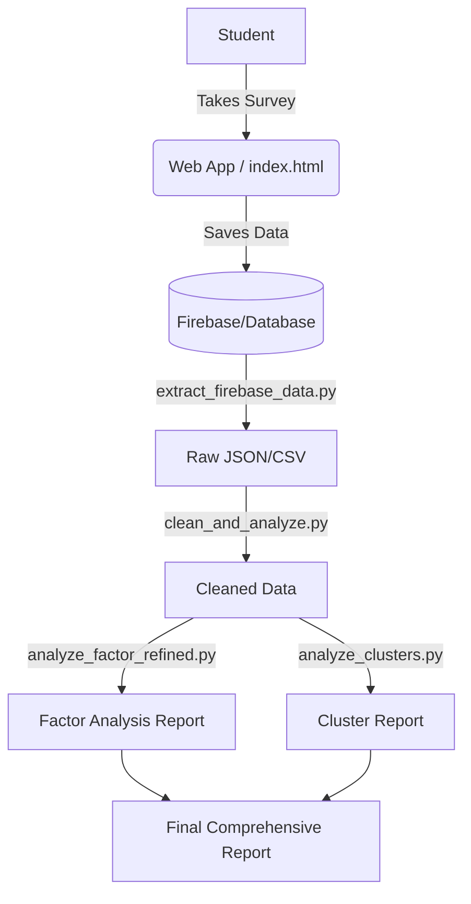

# Student Assessment Project Documentation

## 1. Project Overview
This project is a comprehensive system for administering, scoring, and analyzing the **Guna Personality Inventory (GPI)**. It consists of two main components:
1.  **Web Application**: An interactive survey tool for students to take the assessment.
2.  **Analysis Pipeline**: A Python-based suite (in `analysis/`) for psychometric validation, factor analysis, and clustering of student data.

## 2. Directory Structure

```
student-assessment/
├── index.html              # Entry point for the Web Assessment App
├── src/                    # Client-side JavaScript logic
├── analysis/               # Data Science & Psychometric Analysis Pipeline
├── inference/              # Bayesian inference & dummy data generation
├── original/               # Legacy/Original source code
└── data mapping files      # mappings for BigFive and Guna questions 
```

---

## 3. Key Components

### 🌐 Web Application (`/` & `/src`)
The user-facing interface for taking the survey.
-   **`index.html`**: The main HTML shell.
-   **`src/main.js`**: Core application logic and routing.
-   **`src/scoring.js`**: Real-time scoring algorithms for the assessment.
-   **`src/items.js`**: Contains the question bank.
-   **`style.css`**: Visual styling for the application.

### 📊 Analysis Pipeline (`/analysis`)
The core research engine. This folder contains scripts to process partial or complete data dumps and generate research reports.

#### **Key Reports**
-   **`FINAL_COMPREHENSIVE_REPORT.md`**: The master summary of all findings.
-   **`STUDENT_CLUSTERS_REPORT.md`**: Analysis of identifying 3 distinct student archetypes (Sattvic, Distressed, etc.).
-   **`REFINED_FACTOR_ANALYSIS_REPORT.md`**: Validation of the questionnaire structure using Factor Analysis (PCA/EFA).
-   **`PSYCHOMETRIC_VALIDITY_REPORT.md`**: Statistical validity checks.

#### **Key Scripts**
-   **`extract_firebase_data.py`**: Fetches raw survey data from the backend.
-   **`clean_and_analyze.py`**: Main driver for data cleaning.
-   **`analyze_factor_refined.py`**: Performs dimensionality reduction to validate Guna constructs.
-   **`analyze_clusters.py`**: Uses K-Means clustering to identify student profiles.
-   **`generate_scatter_plots.py`**: Creates visualizations for reports.

### 🧠 Inference (`/inference`)
Experimental or backend logic for probabilistic modeling.
-   **`bayesian_estimation.py`**: Likely used for more advanced scoring models beyond simple sums.
-   **`generate_dummy_data.py`**: For stress testing the pipeline without real user data.

---

## 4. Data Flow



## 5. How to Run Analysis
1.  Ensure you have the latest data dump (e.g., `bfi44_cleaned.json` or `firebase_dump.json`) in the `analysis/` folder.
2.  Run the specific analysis script you need:
    ```bash
    cd analysis
    python analyze_factor_refined.py
    ```
3.  Check the generated Markdown report (e.g., `REFINED_FACTOR_ANALYSIS_REPORT.md`) for results.
