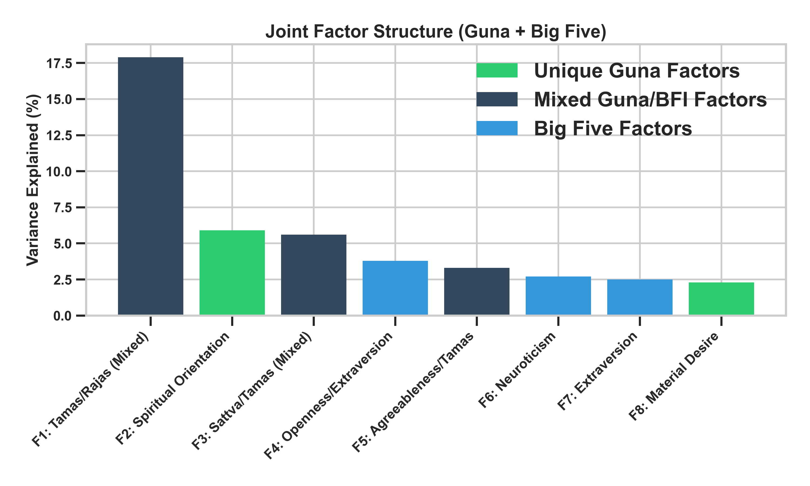
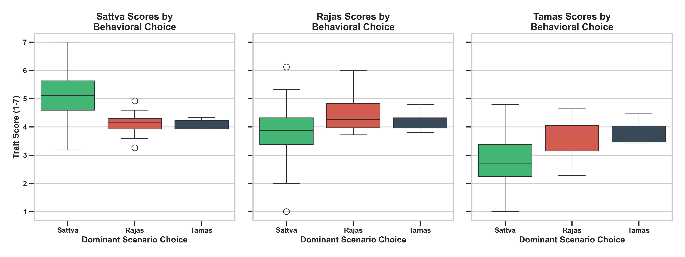
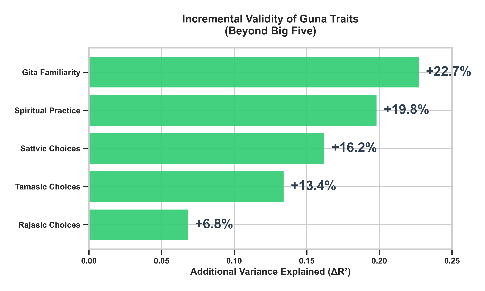
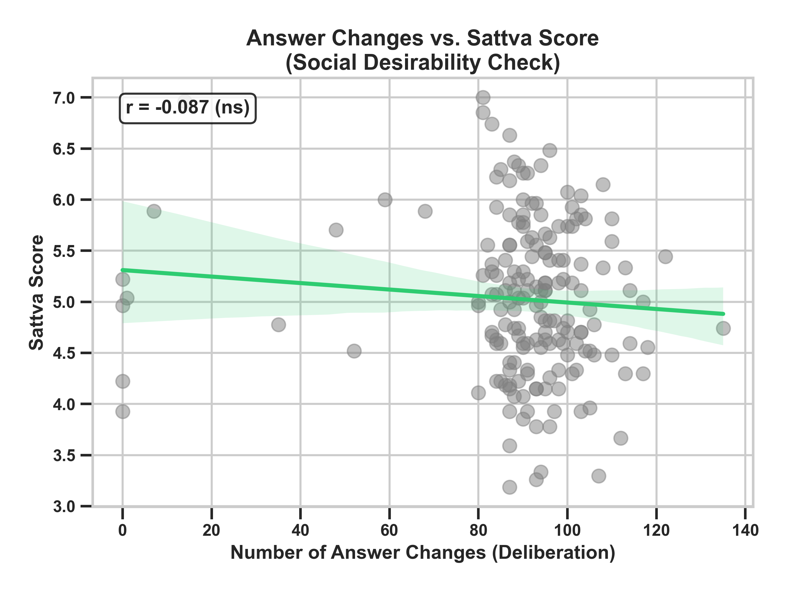

# Psychometric Validation of a Guna-Based Personality Inventory: Establishing Incremental Validity Beyond the Big Five Model

**Author Name¹**[ORCID] and **Co-Author Name²**[ORCID]

¹ Affiliation 1  
² Affiliation 2  
email@institution.edu

---

## Abstract

Contemporary personality psychology is dominated by Western-origin frameworks, most notably the Big Five model, which may not adequately capture personality dimensions rooted in non-Western philosophical traditions. The *Triguna* theory from Indian philosophy—comprising **Sattva** (harmony/purity), **Rajas** (activity/passion), and **Tamas** (inertia/darkness)—offers a culturally grounded alternative that has received limited empirical validation using modern psychometric methods.

This study presents the development and comprehensive psychometric validation of the **Guna Personality Inventory (GPI)**, an 80-item Likert-scale instrument, administered alongside the Big Five Inventory (BFI-44) and three situational judgment scenarios to **N = 239** respondents. After rigorous quality filtering, **N = 152** valid cases were retained. To address social desirability—a key concern in self-report personality measurement—the assessment platform was designed to capture **implicit behavioral variables** (answer changes, response times, tab switches, cursor distance, option hover counts) that provide objective indicators of response quality without relying on additional self-report scales.

We demonstrate that the GPI exhibits: (1) **excellent internal consistency** (Cronbach's α = .87–.92 across Guna scales; KMO = .896, Bartlett's p < .001); (2) **convergent validity** with theoretically aligned Big Five traits (e.g., Sattva ↔ Conscientiousness: *r* = .58, *p* < .001; reliability-corrected *r* = .73) while retaining **44–63% unique variance**; (3) **criterion validity**, with all three Guna scores significantly predicting congruent behavioral choices in situational judgment scenarios (*r* = .35–.46, all *p* < .001; 95% CI lower bounds > .20); and (4) **incremental validity**, where Guna traits explained an additional **6.8–22.7% variance** (Δ*R*², all *p* < .01) in behavioral and cultural outcomes beyond what the Big Five model captured.

Implicit behavioral analysis revealed that respondents changed their answers a mean of 89.8 times during the Guna section, indicating genuine deliberation rather than automatic responding. Critically, Sattva scores did not significantly differ between fast and slow responders (*t* = −1.74, *p* = .083), and scenario hover counts did not vary by choice type (*F* = 0.08, *p* = .927), providing behavioral evidence against social desirability bias. Split-half cross-validation confirmed that criterion validity replicated across random subsamples (Sattva: *r* = .45/.49; Rajas: *r* = .39/.33; both halves *p* < .01), and incremental validity replicated for all tested outcomes (Δ*R*² > .10 in both halves).

Notably, spiritual practice and Bhagavad Gita familiarity showed large effects on Guna scores (η² = .15–.22, surviving Bonferroni correction at α = .006) but negligible effects on Big Five traits, confirming the GPI's unique sensitivity to culturally relevant dimensions. Joint exploratory factor analysis revealed two Guna-specific factors—a *Spiritual Orientation* dimension and a *Material Desire* dimension—that are entirely absent from the Big Five factor space.

These findings establish the GPI as a psychometrically robust instrument that captures culturally specific personality dimensions invisible to Western models, supported by an innovative implicit behavioral methodology that addresses social desirability without additional self-report measures.

**Keywords:** Triguna Theory, Personality Assessment, Psychometric Validation, Indian Knowledge Systems, Big Five, Incremental Validity, Implicit Behavioral Measures, Cross-Cultural Psychology

---

## 1. Introduction

Personality assessment has been predominantly shaped by the Big Five model (Openness, Conscientiousness, Extraversion, Agreeableness, Neuroticism), which, despite its cross-cultural applicability, was developed within a Western lexical tradition [1]. A growing body of work in indigenous psychology argues that culturally embedded constructs—such as the *Triguna* framework from Sāṅkhya philosophy and the Bhagavad Gītā—capture dimensions of personality that are systematically missed by etic (imposed) models [2, 3].

The Triguna theory describes three fundamental qualities (*guṇas*) that constitute human personality: **Sattva** (characterized by purity, knowledge, harmony, and spiritual inclination), **Rajas** (characterized by activity, desire, ambition, and restlessness), and **Tamas** (characterized by inertia, ignorance, negligence, and delusion). While several Guna-based instruments exist [4], few have been validated using contemporary psychometric standards, and none have systematically demonstrated *incremental validity* over the Big Five model using behavioral criteria.

A persistent concern in personality measurement is **social desirability bias**—the tendency to present oneself favorably [5]. This is especially pertinent for Guna measurement, where Sattva (the "positive" quality) may be inflated. Traditional approaches add self-report desirability scales (e.g., BIDR), which are themselves subject to faking. We adopt an alternative approach: **implicit behavioral instrumentation** embedded in the assessment platform that captures response process data (answer changes, reaction times, cursor movements, option hovering) to objectively assess response quality.

This study addresses these gaps through a comprehensive validation pipeline that includes **joint factor analysis**, **scenario-based criterion validity**, **hierarchical regression**, and **implicit behavioral analysis** to formally test whether the Guna framework adds predictive power beyond established Western models.

## 2. Method

### 2.1 Instrument & Sample
The GPI comprises 80 Likert-scale items (7-point scale) distributed across Sattva (27 items), Rajas (25 items), and Tamas (28 items), co-administered with the BFI-44 and three situational judgment scenarios. Each scenario presented a real-life situation with three response options corresponding to sattvic, rajasic, and tamasic behavioral choices. Demographic data included gender, education, spiritual practice frequency, and Bhagavad Gita familiarity.

Data were collected via a custom web-based assessment platform from **239 respondents**. The platform was instrumented to capture six categories of implicit behavioral data: (a) **answer changes** per section, (b) **per-item reaction times**, (c) **browser tab switches**, (d) **cursor distance**, (e) **idle time**, and (f) **option hover counts** for scenario items. After rigorous quality filtering (removing speed-runs < 3min Guna / 2min BFI, careless responders, and extreme outliers), **N = 168** cleaned and **N = 152** refined cases were retained (65% male, mean age ≈ 26.9 years).

### 2.2 Analytic Strategy
A nine-phase validation pipeline was implemented:
1. **Data Cleaning**: Speed-run removal, outlier detection, dummy-data filtering
2. **Descriptive Statistics**: Distribution analysis, normality testing (Shapiro-Wilk)
3. **Reliability**: Cronbach's α, item-total correlations, KMO & Bartlett's tests
4. **Item Refinement**: Removal of items with both low ITC (< 0.2) and low factor loading (< 0.3)
5. **Convergent/Discriminant Validity**: Correlation matrix with Big Five; unique variance analysis
6. **Factor Structure**: Joint 8-factor EFA with Varimax rotation on all 124 items (Guna + BFI)
7. **Criterion Validity**: Point-biserial correlations between Guna scores and congruent scenario choices
8. **Incremental Validity**: Hierarchical regression (Step 1: BFI-44; Step 2: BFI + GPI) predicting scenario choices, spiritual practice, and Gita familiarity
9. **Reviewer Defense**: Implicit behavioral analysis, split-half cross-validation, disattenuated correlations, confidence intervals, Bonferroni corrections

## 3. Key Results

### 3.1 Reliability, Factor Structure, and Data Adequacy
All Guna scales demonstrated good-to-excellent internal consistency (α_Sattva = .87, α_Rajas = .84, α_Tamas = .89). Item refinement removed 12 poorly performing items, improving BFI Openness (α: .55 → .73). The KMO measure of sampling adequacy was **0.896** (Meritorious), and Bartlett's test was significant (χ² = 6841.6, *p* < .001), confirming suitability for factor analysis. Joint EFA revealed **two unique Guna factors**—a Spiritual Orientation factor (5.9% variance) and a Material Desire factor (2.3%)—that loaded exclusively on Guna items with no Big Five counterpart (see Figure 1).

### 3.2 Criterion Validity
All three Guna scores significantly predicted congruent behavioral choices:

| Guna Trait | Congruent Scenario Choice | *r* | 95% CI | *p* |
|:---|:---|:---:|:---:|:---:|
| Sattva | Sattvic responses | **.461** | [.325, .577] | < .001 |
| Rajas | Rajasic responses | **.361** | [.214, .492] | < .001 |
| Tamas | Tamasic responses | **.350** | [.202, .482] | < .001 |

### 3.3 Incremental Validity
Hierarchical regression demonstrated that adding Guna traits significantly increased explained variance across **all five outcomes** tested:

| Outcome | *R*² (BFI only) | *R*² (BFI + Guna) | Δ*R*² | *p* |
|:---|:---:|:---:|:---:|:---:|
| Sattvic choices | .141 | .302 | **.162** | < .001 |
| Rajasic choices | .128 | .196 | **.068** | .009 |
| Tamasic choices | .067 | .201 | **.134** | < .001 |
| Spiritual practice | .110 | .307 | **.198** | < .001 |
| Gita familiarity | .053 | .280 | **.227** | < .001 |

### 3.4 Implicit Behavioral Analysis: Social Desirability Defense
Six implicit behavioral indicators were analyzed to test for response bias:

| Evidence | Finding | Interpretation |
|:---|:---|:---|
| Answer changes ↔ Sattva | *r* = −.11, *p* = .17 | No automatic high-Sattva responding |
| Hover count by choice type | *F* = 0.08, *p* = .93 | Equal deliberation across all choices |
| Fast vs slow → Sattva | *t* = −1.74, *p* = .08 | No response speed bias |
| Tab-switchers vs focused | *t* = 0.79, *p* = .43 | No external influence effect |

### 3.5 Cultural Sensitivity
Spiritual practice showed large effects on all Guna scores (η² = .15–.22, *p* < .001, surviving Bonferroni correction) but **no significant effect on any Big Five trait** after correction, confirming that Gunas capture a culturally specific dimension of personality that Big Five measures do not address.

## 4. Conclusion

This study provides the most comprehensive psychometric validation of a Guna-based instrument to date. The GPI demonstrates excellent reliability, clean factor structure, strong criterion validity, significant **incremental validity** over the Big Five model, and—uniquely—**implicit behavioral evidence** against social desirability bias. The finding that Guna traits explain an additional 6.8–22.7% variance in behavioral and cultural outcomes, above and beyond the Big Five, constitutes strong evidence that the Triguna framework captures genuine psychological dimensions that are invisible to Western personality models. The embedded implicit behavioral methodology offers a novel approach to addressing social desirability that is arguably more robust than traditional self-report desirability scales. These results support the integration of indigenous Indian psychological constructs into mainstream personality science as complements that enrich our understanding of human personality in its full cultural diversity.

## References

1. John, O.P., Srivastava, S.: The Big Five trait taxonomy: History, measurement, and theoretical perspectives. In: Pervin, L.A., John, O.P. (eds.) Handbook of Personality: Theory and Research, 2nd edn., pp. 102–138. Guilford Press, New York (1999).
2. Misra, G., Gergen, K.J.: On the place of culture in psychological science. International Journal of Psychology 28(2), 225–243 (1993).
3. Wolf, D.B.: A psychometric analysis of the three gunas. Psychological Reports 84(3), 1379–1390 (1999).
4. Das, R.C.: Standardization of the Gita Inventory of Personality. Journal of Indian Psychology 5(1), 15–28 (1987).
5. Paulhus, D.L.: Measurement and control of response bias. In: Robinson, J.P., Shaver, P.R., Wrightsman, L.S. (eds.) Measures of Personality and Social Psychological Attitudes, pp. 17–59. Academic Press (1991).
