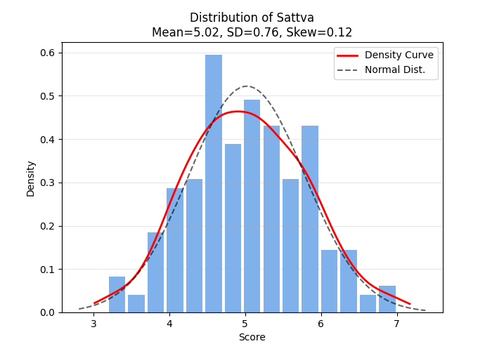
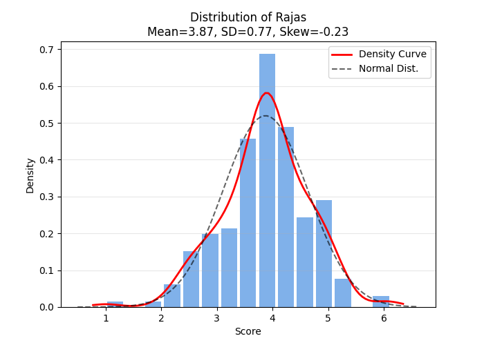
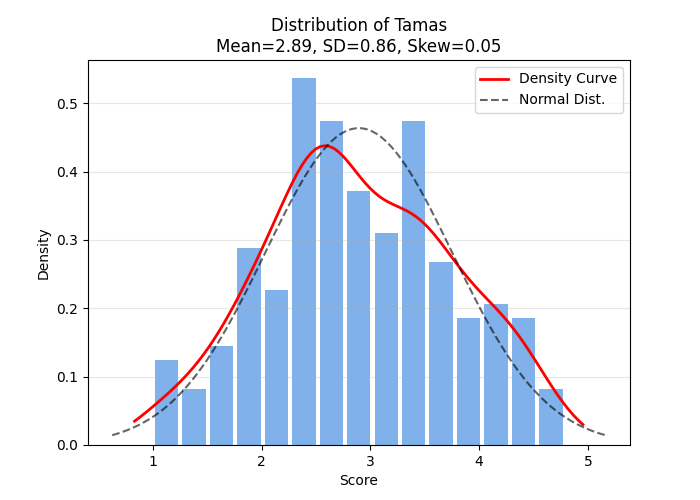
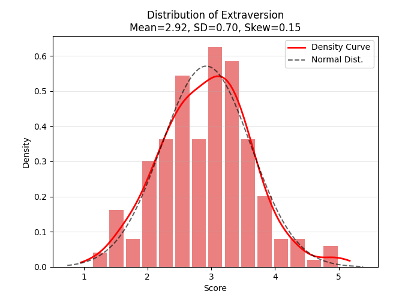
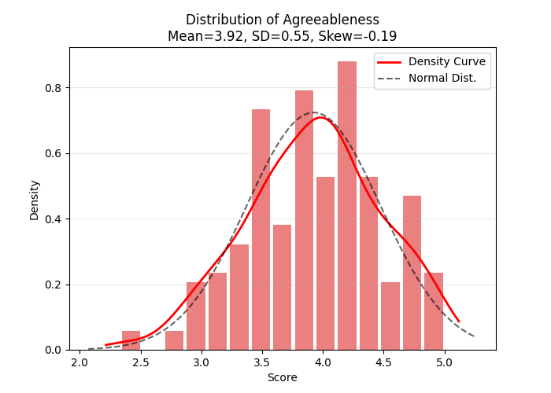
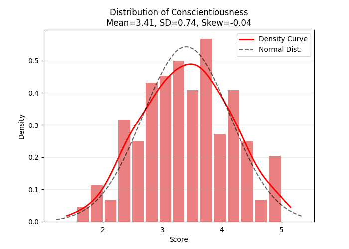
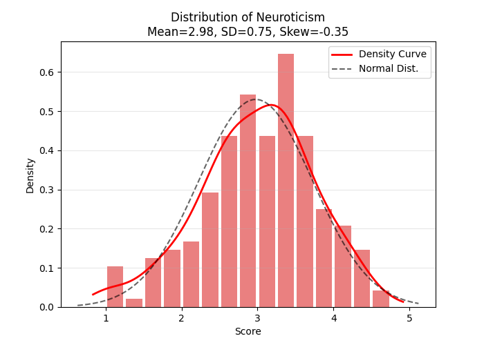
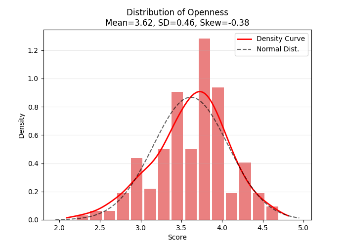

# Phase 1: Descriptive Statistics & Data Screening 📊

**Sample Size**: $N = 192$ (Cleaned Dataset)

## 1. Objectives of Phase 1
In personality research (like the Big Five or GPI), Phase 1 serves three critical functions:
1.  **Demographic Profiling**: Ensuring the sample is representative and identifying relevant subgroups (e.g., Gender, Year of Study).
2.  **Descriptive Baselines**: Establishing the 'norm' for the population. What is the average Sattva score for a university student?
3.  **Distributional Analysis (Normality Check)**:
    *   *Why it matters*: Most advanced statistical tests (ANOVA, Pearson Correlation, Factor Analysis) assume data follows a normal 'Bell Curve'.
    *   *Deviation*: Significant skewness indicates the need for non-parametric tests (e.g., Spearman Correlation instead of Pearson) or data transformation.

---

## 2. Demographic Profile

### Gender Distribution
| Gender | Count | Percentage (%) |
| --- | --- | --- |
| Male | 122 | 63.5 |
| Female | 69 | 35.9 |
| Prefer Not To Say | 1 | 0.5 |

### Age Statistics
- **Mean**: 26.9 years
- **Range**: 14.0 - 70.0 years
- **Std Dev**: 11.27

---

## 3. Psychometric Profile (Descriptive Statistics)
Detailed statistics for the three Guna traits and the Big Five personality traits.

| Trait | Mean | Std. Error | Std. Dev | Skewness | Kurtosis | Shapiro-Wilk ($p$) | Normality |
| :--- | :--- | :--- | :--- | :--- | :--- | :--- | :--- |
| **Sattva** | 5.02 | 0.06 | 0.76 | 0.12 | -0.27 | 0.6374 | ✅ Yes |
| **Rajas** | 3.87 | 0.06 | 0.77 | -0.23 | 0.70 | 0.1178 | ✅ Yes |
| **Tamas** | 2.89 | 0.06 | 0.86 | 0.05 | -0.60 | 0.0819 | ✅ Yes |
| **Extraversion** | 2.92 | 0.05 | 0.70 | 0.15 | 0.25 | 0.2124 | ✅ Yes |
| **Agreeableness** | 3.92 | 0.04 | 0.55 | -0.19 | -0.28 | 0.0627 | ✅ Yes |
| **Conscientiousness** | 3.41 | 0.05 | 0.74 | -0.04 | -0.44 | 0.2866 | ✅ Yes |
| **Neuroticism** | 2.98 | 0.05 | 0.75 | -0.35 | 0.03 | 0.0460 | ❌ No |
| **Openness** | 3.62 | 0.03 | 0.46 | -0.38 | 0.18 | 0.0289 | ❌ No |

## 4. Detailed Interpretation & Implications
### Sattva
- **Distribution**: ✅ Yes ($p=0.6374$)
- **Skewness**: 0.12 (Symmetrical)
- **Implication**: Follows a normal distribution. Standard parametric tests valid.

### Rajas
- **Distribution**: ✅ Yes ($p=0.1178$)
- **Skewness**: -0.23 (Symmetrical)
- **Implication**: Follows a normal distribution. Standard parametric tests valid.

### Tamas
- **Distribution**: ✅ Yes ($p=0.0819$)
- **Skewness**: 0.05 (Symmetrical)
- **Implication**: Follows a normal distribution. Standard parametric tests valid.

### Extraversion
- **Distribution**: ✅ Yes ($p=0.2124$)
- **Skewness**: 0.15 (Symmetrical)
- **Implication**: Follows a normal distribution. Standard parametric tests valid.

### Agreeableness
- **Distribution**: ✅ Yes ($p=0.0627$)
- **Skewness**: -0.19 (Symmetrical)
- **Implication**: Follows a normal distribution. Standard parametric tests valid.

### Conscientiousness
- **Distribution**: ✅ Yes ($p=0.2866$)
- **Skewness**: -0.04 (Symmetrical)
- **Implication**: Follows a normal distribution. Standard parametric tests valid.

### Neuroticism
- **Distribution**: ❌ No ($p=0.0460$)
- **Skewness**: -0.35 (Symmetrical)
- **Implication**: Deviates from normality. Scores are clustered at the high end (Negative Skew).

### Openness
- **Distribution**: ❌ No ($p=0.0289$)
- **Skewness**: -0.38 (Symmetrical)
- **Implication**: Deviates from normality. Scores are clustered at the high end (Negative Skew).

### Interpretation Guidelines
- **Sattva (Balance)** often shows a 'Negative Skew' in healthy populations (Self-Selection bias).
- **Tamas (Inertia)** often shows a 'Positive Skew' (most students are active/low Tamas).
- **Neuroticism**: High scores indicate stress/instability; usually skewed positively in healthy populations.
- **Conscientiousness/Agreeableness**: Often negatively skewed (most people rate themselves highly).
- **Methodological Note**: If normality is violated (❌), we should use **Spearman's Rank Correlation** in Phase 3 instead of Pearson's.