# Phase 2: Reliability & Item Analysis Report 📉

**Date**: 2026-02-19
**Dataset**: N=181

## 1. Reliability Summary
| Scale | Items | Cronbach's Alpha | Status |
| :--- | :---: | :---: | :--- |
| **Sattva** | 27 | **0.865** | ✅ Good |
| **Rajas** | 25 | **0.833** | ✅ Good |
| **Tamas** | 28 | **0.893** | ✅ Good |
| **Agreeableness** | 9 | **0.652** | ⚠️ Questionable |
| **Conscientiousness** | 9 | **0.796** | ⚠️ Acceptable |
| **Extraversion** | 8 | **0.721** | ⚠️ Acceptable |
| **Neuroticism** | 8 | **0.778** | ⚠️ Acceptable |
| **Openness** | 10 | **0.537** | ❌ Poor |

> **Note**: Alpha > 0.7 is generally considered acceptable.

## 2. Detailed Item Analysis & Charts

### Sattva (Alpha: 0.865)
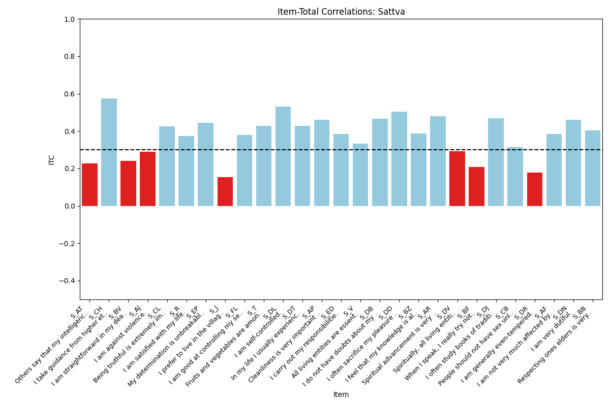
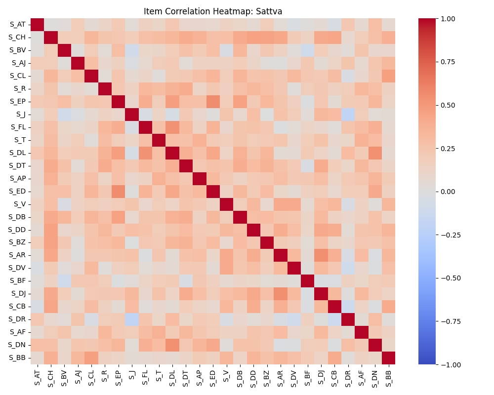

⚠️ **Potential Problematic Items:**

| Item | Question Text | ITC | Alpha if Deleted | Issue Flag |
| :--- | :--- | :---: | :---: | :--- |
| S_AT | Others say that my intelligence is very sharp. | 0.228 | **0.865** | Low ITC |
| S_BV | I am straightforward in my dealings with other people. | 0.240 | **0.864** | Low ITC |
| S_AJ | I am against violence. | 0.290 | **0.864** | Low ITC |
| S_J | I prefer to live in the village rather than the city. | 0.154 | **0.867** | Low ITC |
| S_DV | Spiritually, all living entities are equal. | 0.292 | **0.863** | Low ITC |
| S_BF | When I speak, I really try not to irritate others. | 0.209 | **0.865** | Low ITC |
| S_DR | I am generally even-tempered. | 0.177 | **0.866** | Low ITC |

**Recommendation**: Consider removing **S_AT, S_J, S_BF, S_DR** to improve scale reliability.

### Rajas (Alpha: 0.833)
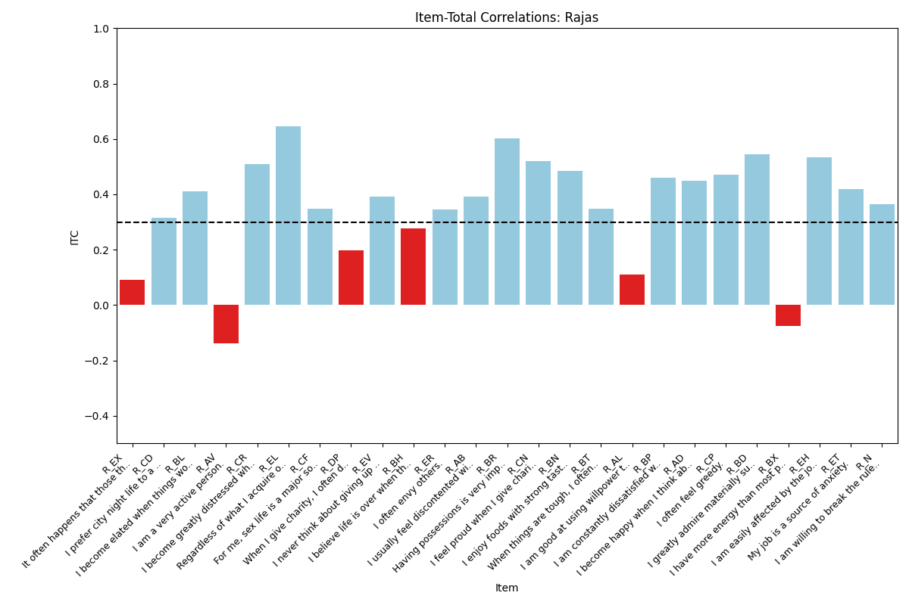
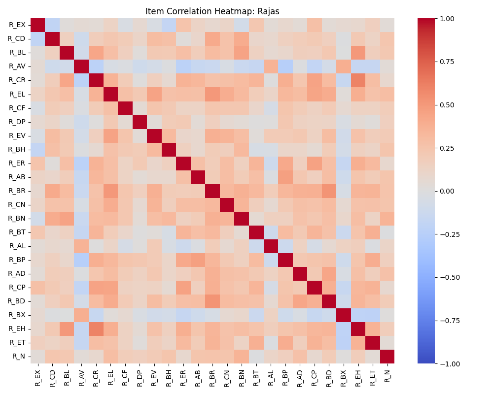

⚠️ **Potential Problematic Items:**

| Item | Question Text | ITC | Alpha if Deleted | Issue Flag |
| :--- | :--- | :---: | :---: | :--- |
| R_EX | It often happens that those things that brought me happiness later become the source of my suffering. | 0.092 | **0.837** | Low ITC |
| R_AV | I am a very active person. | -0.139 | **0.845** | Low ITC Alpha Improve |
| R_DP | When I give charity, I often do it grudgingly. | 0.197 | **0.833** | Low ITC |
| R_BH | I believe life is over when the body dies. | 0.276 | **0.832** | Low ITC |
| R_AL | I am good at using willpower to achieve goals. | 0.110 | **0.836** | Low ITC |
| R_BX | I have more energy than most people. | -0.074 | **0.843** | Low ITC Alpha Improve |

**Recommendation**: Consider removing **R_EX, R_AV, R_DP, R_AL, R_BX** to improve scale reliability.

### Tamas (Alpha: 0.893)
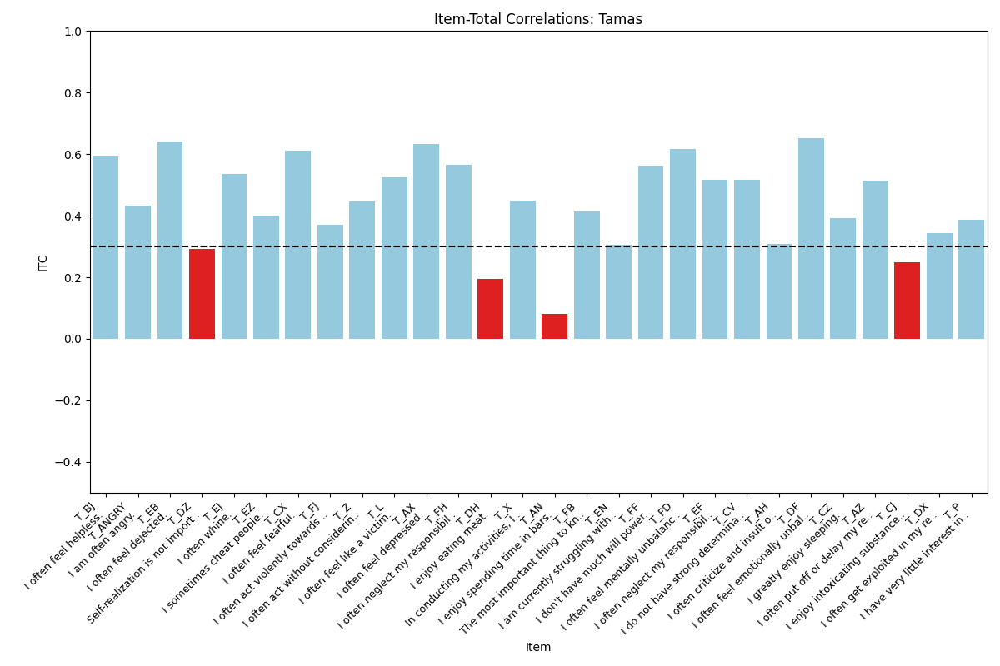
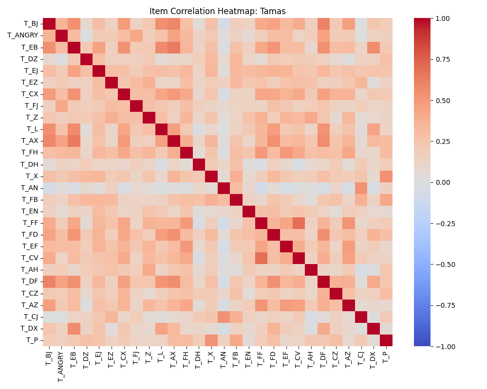

⚠️ **Potential Problematic Items:**

| Item | Question Text | ITC | Alpha if Deleted | Issue Flag |
| :--- | :--- | :---: | :---: | :--- |
| T_DZ | Self-realization is not important for me. | 0.292 | **0.893** | Low ITC |
| T_DH | I enjoy eating meat. | 0.196 | **0.897** | Low ITC |
| T_AN | I enjoy spending time in bars. | 0.081 | **0.895** | Low ITC |
| T_CJ | I enjoy intoxicating substances (including coffee, cigarettes and alcohol). | 0.249 | **0.893** | Low ITC |

**Recommendation**: Consider removing **T_DH, T_AN** to improve scale reliability.

### Agreeableness (Alpha: 0.652)
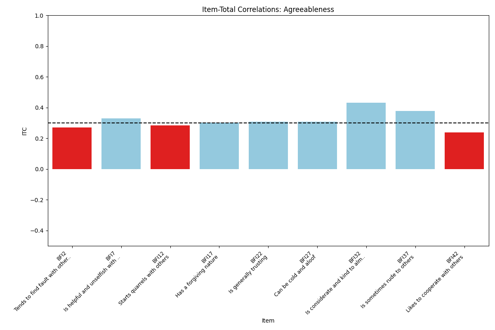
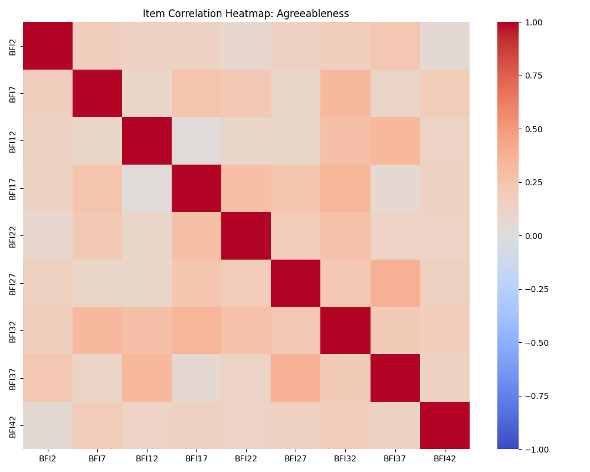

⚠️ **Potential Problematic Items:**

| Item | Question Text | ITC | Alpha if Deleted | Issue Flag |
| :--- | :--- | :---: | :---: | :--- |
| BFI2 | Tends to find fault with others | 0.271 | **0.649** | Low ITC |
| BFI12 | Starts quarrels with others | 0.284 | **0.632** | Low ITC |
| BFI42 | Likes to cooperate with others | 0.239 | **0.641** | Low ITC |

### Conscientiousness (Alpha: 0.796)
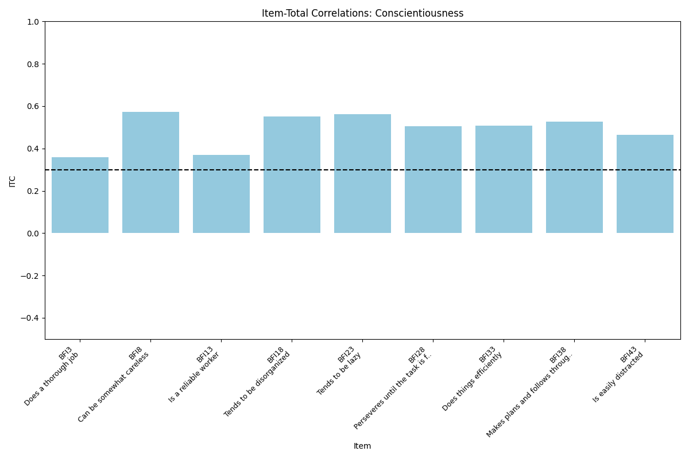
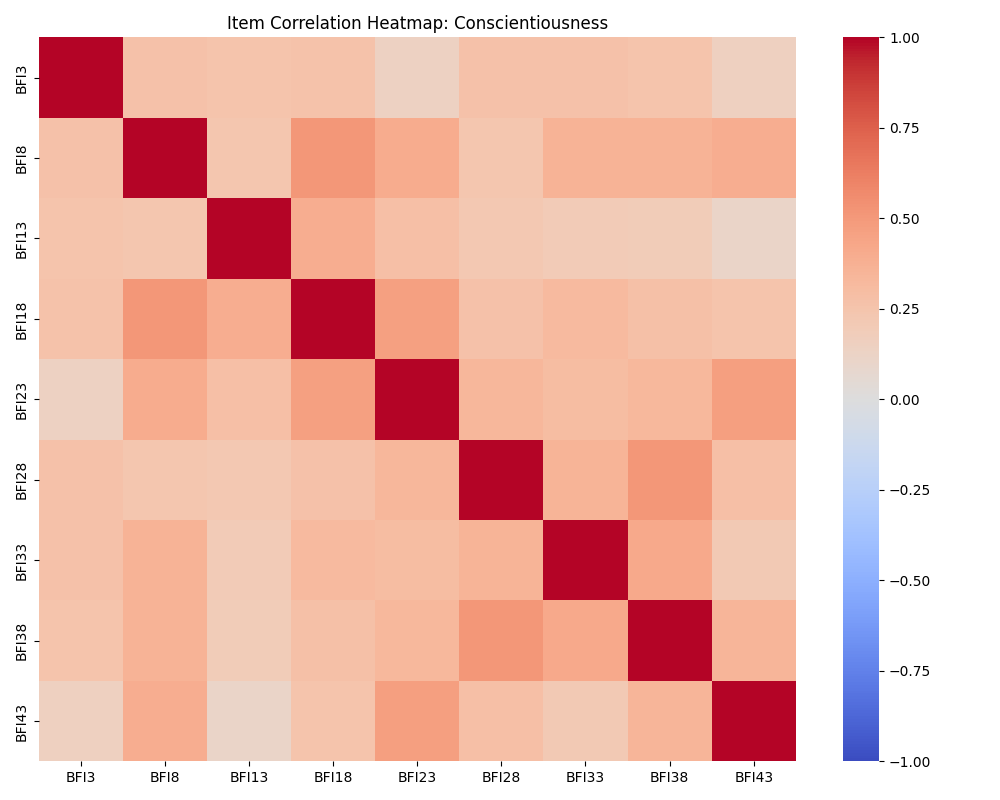

✅ **All items are performing well.** No removal recommended.

### Extraversion (Alpha: 0.721)
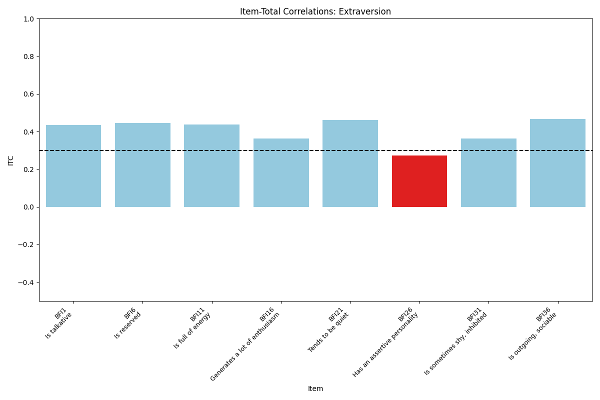
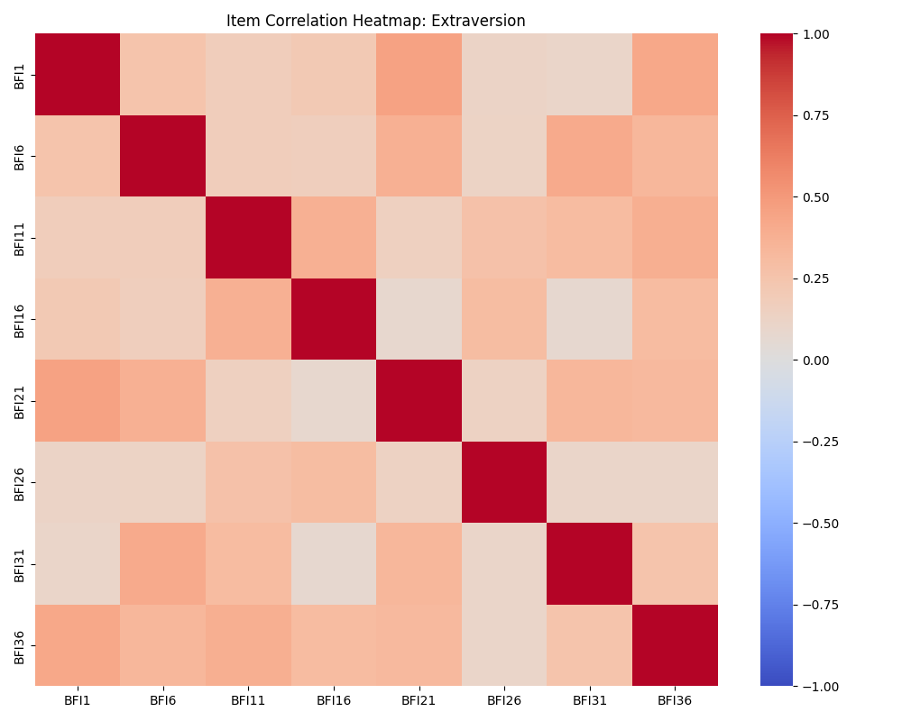

⚠️ **Potential Problematic Items:**

| Item | Question Text | ITC | Alpha if Deleted | Issue Flag |
| :--- | :--- | :---: | :---: | :--- |
| BFI26 | Has an assertive personality | 0.272 | **0.721** | Low ITC |

### Neuroticism (Alpha: 0.778)
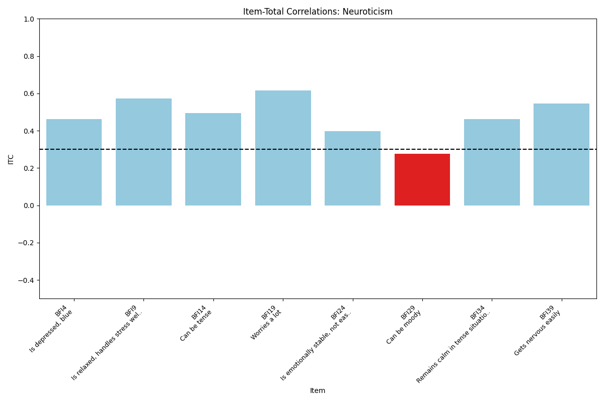
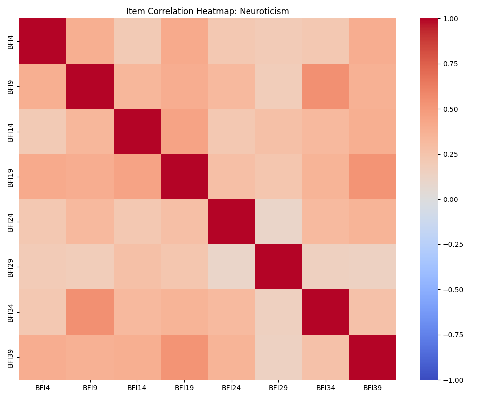

⚠️ **Potential Problematic Items:**

| Item | Question Text | ITC | Alpha if Deleted | Issue Flag |
| :--- | :--- | :---: | :---: | :--- |
| BFI29 | Can be moody | 0.276 | **0.787** | Low ITC |

**Recommendation**: Consider removing **BFI29** to improve scale reliability.

### Openness (Alpha: 0.537)
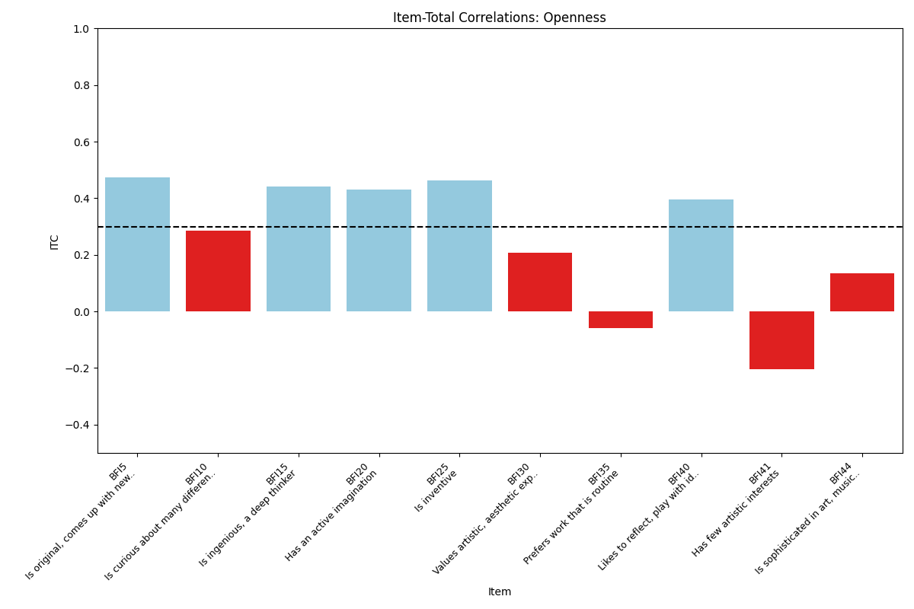
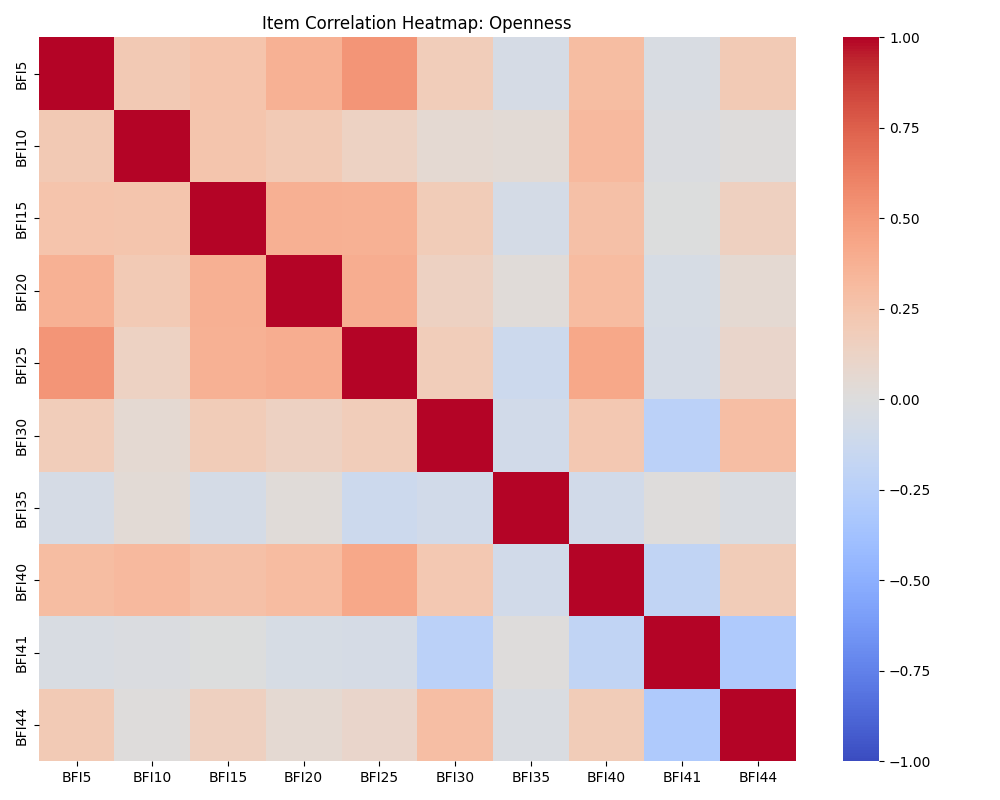

⚠️ **Potential Problematic Items:**

| Item | Question Text | ITC | Alpha if Deleted | Issue Flag |
| :--- | :--- | :---: | :---: | :--- |
| BFI10 | Is curious about many different things | 0.286 | **0.501** | Low ITC |
| BFI30 | Values artistic, aesthetic experiences | 0.207 | **0.507** | Low ITC |
| BFI35 | Prefers work that is routine | -0.059 | **0.604** | Low ITC Alpha Improve |
| BFI41 | Has few artistic interests | -0.203 | **0.639** | Low ITC Alpha Improve |
| BFI44 | Is sophisticated in art, music, or literature | 0.135 | **0.540** | Low ITC |

**Recommendation**: Consider removing **BFI35, BFI41, BFI44** to improve scale reliability.