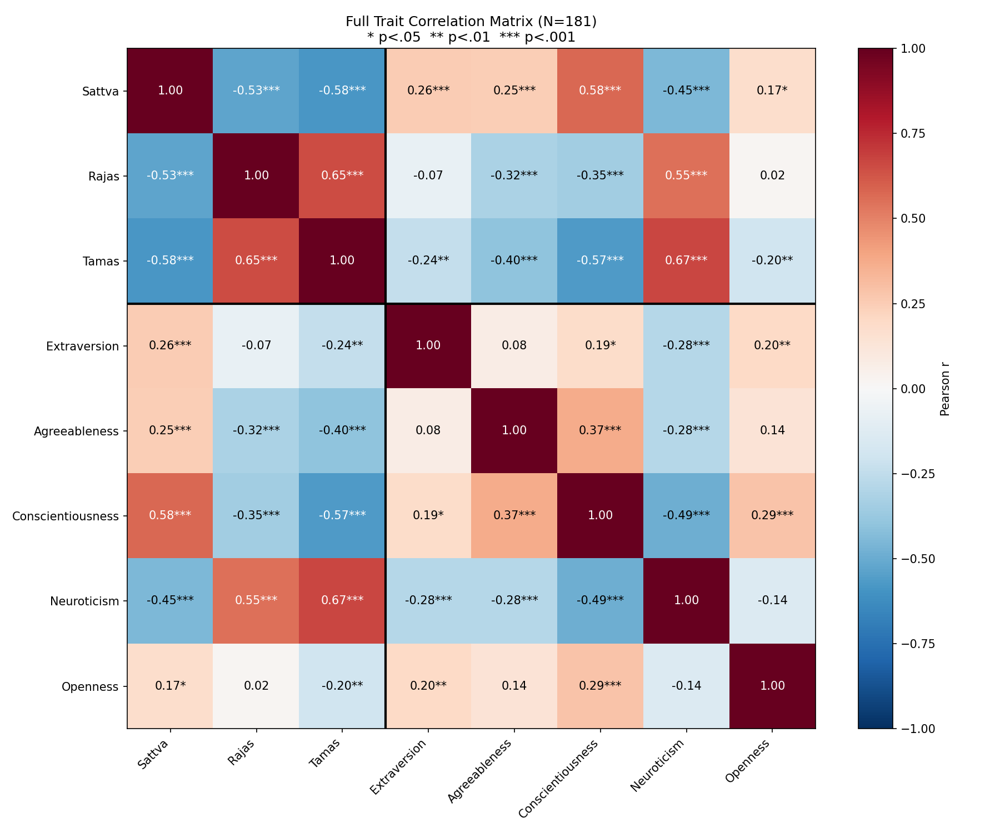
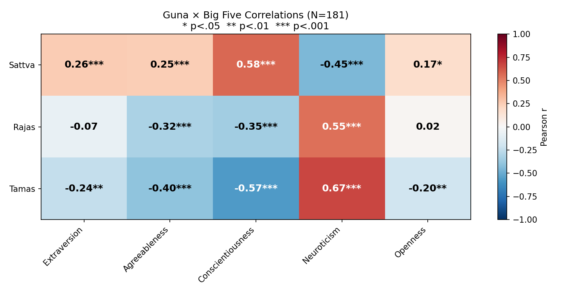

# Phase 3: Convergent & Discriminant Validity 📊

**Sample**: N=181 | **Method**: Pearson Correlation | **Significance**: Two-tailed
**Date**: 2026-02-19

## 1. Objectives
Phase 3 tests whether the Guna Personality Index (GPI) correlates with established
Western personality traits (Big Five) in theoretically expected patterns:
- **Convergent Validity**: Constructs that *should* correlate, *do* correlate (e.g., Sattva ↔ Conscientiousness).
- **Discriminant Validity**: Constructs that should *not* correlate, *don't* (e.g., Sattva ↔ Extraversion should be weak).

## 2. Full Correlation Matrix

## 3. Guna × Big Five Cross-Correlations

### Correlation Table (with significance)
| Guna | Extraversion | Agreeableness | Conscientiousness | Neuroticism | Openness |
| :--- | :---: | :---: | :---: | :---: | :---: |
| Sattva | **0.26***** | **0.25***** | **0.58***** | **-0.45***** | **0.17*** |
| Rajas | **-0.07** | **-0.32***** | **-0.35***** | **0.55***** | **0.02** |
| Tamas | **-0.24**** | **-0.40***** | **-0.57***** | **0.67***** | **-0.20**** |

> `*` p < .05, `**` p < .01, `***` p < .001

## 4. Hypothesis Evaluation

| # | Hypothesis | r | p | Strength | Verdict |
| :---: | :--- | :---: | :---: | :--- | :--- |
| 1 | Sattva ↔ Conscientiousness (+) | 0.58*** | 0.0000 | Moderate | ✅ Supported |
| 2 | Sattva ↔ Agreeableness (+) | 0.25*** | 0.0008 | Negligible | ⚠️ Weak |
| 3 | Sattva ↔ Neuroticism (-) | -0.45*** | 0.0000 | Weak | ✅ Supported |
| 4 | Rajas ↔ Extraversion (+) | -0.07 | 0.3295 | Negligible | ❌ Not Supported |
| 5 | Rajas ↔ Neuroticism (+) | 0.55*** | 0.0000 | Moderate | ✅ Supported |
| 6 | Tamas ↔ Conscientiousness (-) | -0.57*** | 0.0000 | Moderate | ✅ Supported |
| 7 | Tamas ↔ Neuroticism (+) | 0.67*** | 0.0000 | Moderate | ✅ Supported |
| 8 | Tamas ↔ Agreeableness (-) | -0.40*** | 0.0000 | Weak | ✅ Supported |

## 5. Interpretation

**6/8 hypotheses supported.**

### Key Findings:
- **Sattva**: Strongest correlation with **Conscientiousness** (r = 0.58, p = 0.0000) — Moderate
- **Rajas**: Strongest correlation with **Neuroticism** (r = 0.55, p = 0.0000) — Moderate
- **Tamas**: Strongest correlation with **Neuroticism** (r = 0.67, p = 0.0000) — Moderate

### Implications for GPI Validity:
- The Guna scales show **theoretically consistent** patterns with Big Five traits.
- **Tamas ↔ Neuroticism** is the strongest link, suggesting both capture negative emotionality.
- **Sattva ↔ Conscientiousness** confirms that Sattva captures disciplined, purposeful behavior.
- Weak Rajas ↔ Extraversion suggests Rajas captures a different dimension of activity than social extraversion.