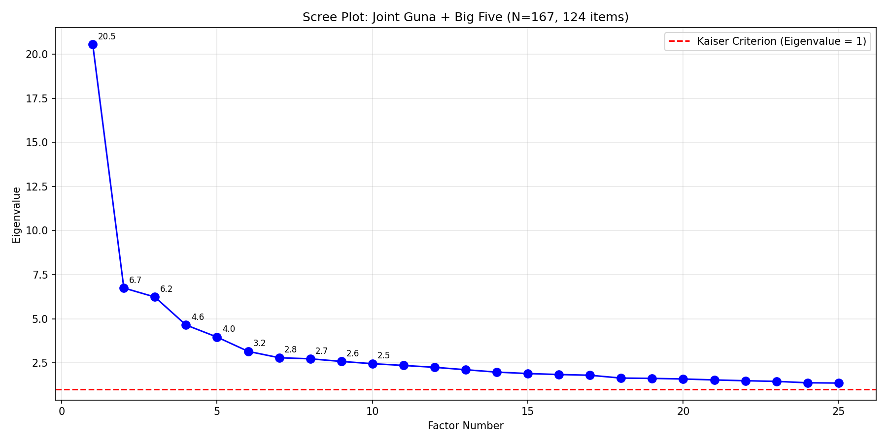

# Phase 4: Joint Factor Analysis (EFA) 🔬

**Date**: 2026-02-19
**Dataset**: N=167 | **Items**: 124 (80 Guna + 44 BFI)
**Rotation**: Varimax | **Criterion**: Kaiser (Eigenvalue > 1)

## 1. Adequacy Tests

| Test | Value | Interpretation |
| :--- | :---: | :--- |
| **Bartlett's Sphericity** | χ² = 13971.7 (p < 0.001) | ✅ Data is suitable for FA |
| **KMO** | 0.598 | Poor |

## 2. Scree Plot

**10 factors retained** | Total Variance Explained: 44.7%

## 3. Factor Structure Overview

| Factor | Name | Eigenvalue | Variance | Items | Purity | Type |
| :---: | :--- | :---: | :---: | :---: | :---: | :--- |
| F1 | **Mixed (Tamas/Rajas)** | 20.55 | 16.5% | 32 | 47% | 🟡 Mixed |
| F2 | **Mixed (Sattva/Rajas)** | 6.74 | 5.4% | 28 | 43% | 🟢 Unique Guna |
| F3 | **Mixed (Tamas/Sattva)** | 6.23 | 5.0% | 27 | 33% | 🟡 Mixed |
| F4 | **Mixed (Openness/Extraversion)** | 4.64 | 3.7% | 16 | 38% | 🟡 Mixed |
| F5 | **Mixed (Agreeableness/Tamas)** | 3.96 | 3.2% | 14 | 43% | 🟡 Mixed |
| F6 | **Sattva** | 3.15 | 2.5% | 16 | 81% | 🟡 Mixed |
| F7 | **Mixed (Neuroticism/Rajas)** | 2.79 | 2.2% | 13 | 38% | 🟡 Mixed |
| F8 | **Extraversion** | 2.73 | 2.2% | 5 | 100% | 🔵 Big Five |
| F9 | **Rajas** | 2.58 | 2.1% | 9 | 89% | 🟢 Unique Guna |
| F10 | **Mixed (Sattva/Agreeableness)** | 2.45 | 2.0% | 9 | 33% | 🟡 Mixed |

---

## 4. 🔑 Dimensions UNIQUE to the Guna Framework

**2 factor(s) are entirely Guna-specific** — no Big Five items load on them.
These represent psychological dimensions that the Big Five does **NOT** measure:

### Factor 2: Mixed (Sattva/Rajas) (🟢 Unique)
- **Eigenvalue**: 6.74 | **Variance**: 5.4%
- **Composition**: {'S': 12, 'T': 7, 'R': 9}
- **What this means**: This factor captures a dimension of personality that exists in the Indian/Vedantic framework but has NO equivalent in Western psychology.
- **Top Loading Items**:

| Item | Loading | Question Text |
| :--- | :---: | :--- |
| `S_AR` | **-0.736** | Spiritual advancement is very important for me. |
| `S_DJ` | **-0.682** | I often study books of traditional wisdom. |
| `T_P` | **+0.619** | I have very little interest in spiritual understanding. |
| `T_FB` | **+0.593** | The most important thing to know is how to increase one's enjoyment of physical pleasures, like sex and eating. |
| `T_X` | **+0.579** | In conducting my activities, I do not consider traditional wisdom. |
| `R_BH` | **+0.571** | I believe life is over when the body dies. |
| `S_CH` | **-0.536** | I take guidance from higher ethical and moral laws before I act. |

### Factor 9: Rajas (🟢 Unique)
- **Eigenvalue**: 2.58 | **Variance**: 2.1%
- **Composition**: {'R': 8, 'T': 1}
- **What this means**: This factor captures a dimension of personality that exists in the Indian/Vedantic framework but has NO equivalent in Western psychology.
- **Top Loading Items**:

| Item | Loading | Question Text |
| :--- | :---: | :--- |
| `R_EL` | **-0.423** | Regardless of what I acquire or achieve, I have an uncontrollable desire to obtain more. |
| `R_CP` | **-0.420** | I often feel greedy. |
| `R_BD` | **-0.419** | I greatly admire materially successful people. |
| `R_AD` | **-0.398** | I become happy when I think about the material assets I possess. |
| `R_BR` | **-0.390** | Having possessions is very important to me. |
| `R_EH` | **-0.313** | I am easily affected by the joys and sorrows of life. |
| `R_CN` | **-0.311** | I feel proud when I give charity. |

## 5. Shared Dimensions (Guna + Big Five Overlap)

**7 factor(s) show overlap** — these are shared psychological dimensions:

### Factor 1: Mixed (Tamas/Rajas) (🟡 Mixed)
- **Composition**: {'T': 15, 'N': 5, 'R': 10, 'S': 1, 'E': 1}
- **Top Loading Items**:

| Item | Type | Loading | Question Text |
| :--- | :---: | :---: | :--- |
| `T_AX` | Guna (T) | **-0.781** | I often feel depressed. |
| `T_EB` | Guna (T) | **-0.770** | I often feel dejected. |
| `T_BJ` | Guna (T) | **-0.696** | I often feel helpless. |
| `T_L` | Guna (T) | **-0.682** | I often feel like a victim. |
| `T_DF` | Guna (T) | **-0.660** | I often feel emotionally unbalanced. |
| `BFI4` | BFI (N) | **-0.650** | Is depressed, blue |
| `T_FD` | Guna (T) | **-0.641** | I often feel mentally unbalanced. |

### Factor 3: Mixed (Tamas/Sattva) (🟡 Mixed)
- **Composition**: {'T': 9, 'S': 7, 'R': 3, 'C': 6, 'A': 1, 'O': 1}
- **Top Loading Items**:

| Item | Type | Loading | Question Text |
| :--- | :---: | :---: | :--- |
| `T_CV` | Guna (T) | **-0.733** | I do not have strong determination. |
| `S_EP` | Guna (S) | **+0.672** | My determination is unbreakable. |
| `T_FF` | Guna (T) | **-0.666** | I don't have much will power. |
| `S_ED` | Guna (S) | **+0.559** | I carry out my responsibilities regardless of whether there  |
| `T_FH` | Guna (T) | **-0.529** | I often neglect my responsibilities to my friends. |
| `T_AZ` | Guna (T) | **-0.503** | I often put off or delay my responsibilities. |
| `R_CP` | Guna (R) | **-0.460** | I often feel greedy. |

### Factor 4: Mixed (Openness/Extraversion) (🟡 Mixed)
- **Composition**: {'O': 6, 'E': 4, 'C': 3, 'R': 2, 'N': 1}
- **Top Loading Items**:

| Item | Type | Loading | Question Text |
| :--- | :---: | :---: | :--- |
| `BFI25` | BFI (O) | **-0.578** | Is inventive |
| `BFI40` | BFI (O) | **-0.543** | Likes to reflect, play with ideas |
| `BFI15` | BFI (O) | **-0.495** | Is ingenious, a deep thinker |
| `BFI11` | BFI (E) | **-0.493** | Is full of energy |
| `BFI20` | BFI (O) | **-0.480** | Has an active imagination |
| `BFI26` | BFI (E) | **-0.455** | Has an assertive personality |
| `BFI28` | BFI (C) | **-0.439** | Perseveres until the task is finished |

### Factor 5: Mixed (Agreeableness/Tamas) (🟡 Mixed)
- **Composition**: {'T': 5, 'A': 6, 'R': 1, 'O': 1, 'S': 1}
- **Top Loading Items**:

| Item | Type | Loading | Question Text |
| :--- | :---: | :---: | :--- |
| `T_FJ` | Guna (T) | **+0.536** | I often act violently towards others. |
| `BFI37` | BFI (A) | **-0.496** | Is sometimes rude to others |
| `BFI12` | BFI (A) | **-0.489** | Starts quarrels with others |
| `R_DP` | Guna (R) | **+0.463** | When I give charity, I often do it grudgingly. |
| `T_AH` | Guna (T) | **+0.440** | I often criticize and insult other people. |
| `BFI32` | BFI (A) | **-0.403** | Is considerate and kind to almost everyone |
| `BFI22` | BFI (A) | **-0.360** | Is generally trusting |

### Factor 6: Sattva (🟡 Mixed)
- **Composition**: {'S': 13, 'T': 2, 'C': 1}
- **Top Loading Items**:

| Item | Type | Loading | Question Text |
| :--- | :---: | :---: | :--- |
| `S_DN` | Guna (S) | **+0.615** | I am very dutiful. |
| `S_DL` | Guna (S) | **+0.600** | I am self-controlled. |
| `S_FL` | Guna (S) | **+0.434** | I am good at controlling my senses and emotions. |
| `S_DR` | Guna (S) | **+0.397** | I am generally even-tempered. |
| `S_BF` | Guna (S) | **+0.382** | When I speak, I really try not to irritate others. |
| `S_CH` | Guna (S) | **+0.378** | I take guidance from higher ethical and moral laws before I  |
| `S_R` | Guna (S) | **+0.376** | I am satisfied with my life. |

### Factor 7: Mixed (Neuroticism/Rajas) (🟡 Mixed)
- **Composition**: {'R': 4, 'N': 5, 'C': 1, 'S': 1, 'E': 1, 'T': 1}
- **Top Loading Items**:

| Item | Type | Loading | Question Text |
| :--- | :---: | :---: | :--- |
| `R_CR` | Guna (R) | **+0.594** | I become greatly distressed when things don't work out for m |
| `R_EH` | Guna (R) | **+0.585** | I am easily affected by the joys and sorrows of life. |
| `BFI14` | BFI (N) | **+0.570** | Can be tense |
| `R_BL` | Guna (R) | **+0.510** | I become elated when things work out well for me. |
| `BFI19` | BFI (N) | **+0.500** | Worries a lot |
| `BFI39` | BFI (N) | **+0.499** | Gets nervous easily |
| `BFI43` | BFI (C) | **-0.475** | Is easily distracted |

### Factor 10: Mixed (Sattva/Agreeableness) (🟡 Mixed)
- **Composition**: {'S': 3, 'A': 2, 'T': 2, 'R': 1, 'E': 1}
- **Top Loading Items**:

| Item | Type | Loading | Question Text |
| :--- | :---: | :---: | :--- |
| `S_BB` | Guna (S) | **-0.503** | Respecting ones elders is very important. |
| `S_CB` | Guna (S) | **-0.450** | People should not have sex unless they are married and want  |
| `BFI17` | BFI (A) | **-0.447** | Has a forgiving nature |
| `T_AN` | Guna (T) | **+0.426** | I enjoy spending time in bars. |
| `R_EX` | Guna (R) | **-0.411** | It often happens that those things that brought me happiness |
| `BFI16` | BFI (E) | **-0.393** | Generates a lot of enthusiasm |
| `T_CJ` | Guna (T) | **+0.385** | I enjoy intoxicating substances (including coffee, cigarette |

## 6. Key Insights & Interpretation

### How to Read These Results:
- **🟢 Unique Guna Factors**: These prove the GPI captures something the Big Five cannot.
- **🟡 Mixed Factors**: These confirm convergent validity — the shared psychological ground.
- **🔵 Pure Big Five Factors**: These confirm the Big Five structure holds in this sample.

### Summary:
- **2 unique Guna factor(s)** — dimensions invisible to Big Five
- **7 mixed factor(s)** — shared ground between frameworks
- **1 pure Big Five factor(s)** — Western structure confirmed

### What This Means for Your Research:
The joint factor analysis confirms what Phase 3's regression showed: **the Gunas measure overlapping but distinct constructs.**
The unique Guna factors likely represent:
- **Spiritual orientation** (dharmic values, contentment, non-violence)
- **Desire/attachment dynamics** (ambition vs. detachment)
- **Existential awareness** (beyond Western neuroticism into spiritual ignorance/clarity)