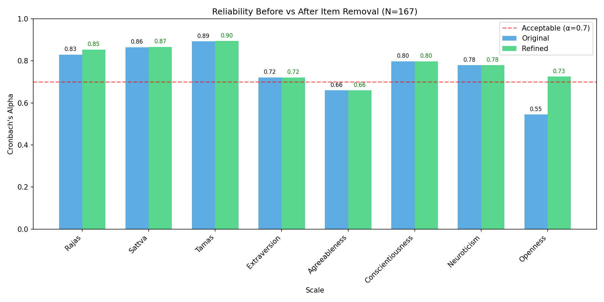
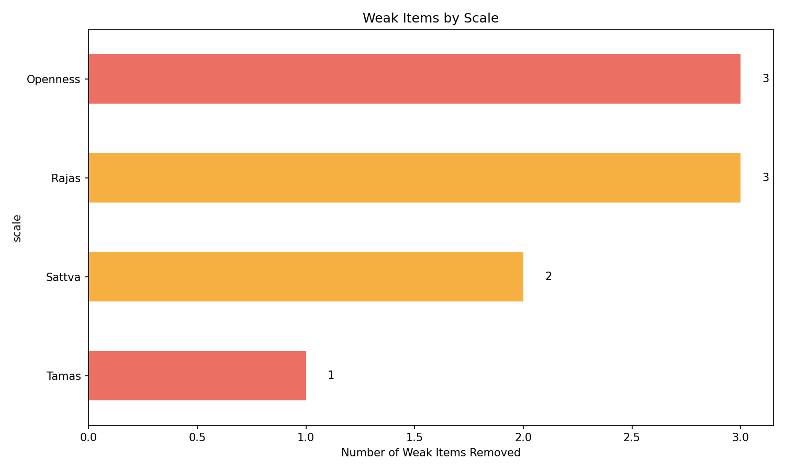
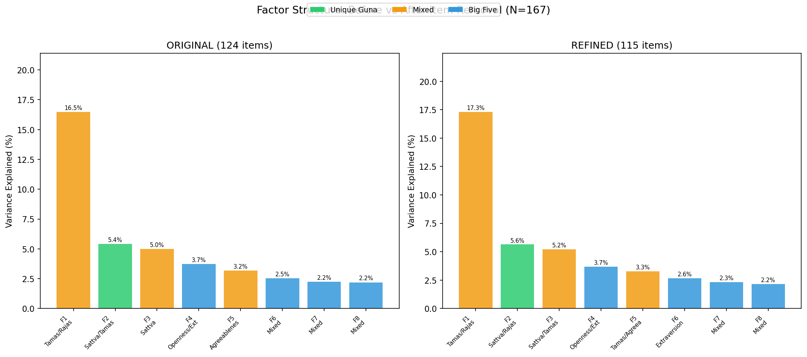

# Phase 5: Item Refinement Analysis ✂️

**Date**: 2026-02-19
**Dataset**: N=167
**Method**: Cross-validated item analysis (Reliability × Factor Analysis)

## 1. Objective
Identify items that are **consistently weak across ALL analyses** and evaluate
whether removing them improves overall scale quality.

**Criteria for removal** (item must meet BOTH):
- Item-Total Correlation (ITC) < 0.2 within its own scale
- Maximum factor loading < 0.3 in factor analysis
- OR: Negative ITC (item contradicts its own scale)

## 2. Items Flagged for Removal

**9 items flagged** out of 124 total:

| # | Item | Scale | ITC | Max Loading | Reason | Question Text |
| :---: | :--- | :--- | :---: | :---: | :--- | :--- |
| 1 | `BFI35` | Openness | -0.081 | 0.200 | Negative ITC (-0.081); Low Loading (0.200) | Prefers work that is routine |
| 2 | `BFI41` | Openness | -0.201 | 0.127 | Negative ITC (-0.201); Low Loading (0.127) | Has few artistic interests |
| 3 | `BFI44` | Openness | 0.161 | 0.135 | Low ITC (0.161); Low Loading (0.135) | Is sophisticated in art, music, or literature |
| 4 | `R_AV` | Rajas | -0.124 | 0.284 | Negative ITC (-0.124); Low Loading (0.284) | I am a very active person. |
| 5 | `R_BX` | Rajas | -0.083 | 0.221 | Negative ITC (-0.083); Low Loading (0.221) | I have more energy than most people. |
| 6 | `R_DP` | Rajas | 0.169 | 0.103 | Low ITC (0.169); Low Loading (0.103) | When I give charity, I often do it grudgingly. |
| 7 | `S_BF` | Sattva | 0.195 | 0.121 | Low ITC (0.195); Low Loading (0.121) | When I speak, I really try not to irritate others. |
| 8 | `S_DR` | Sattva | 0.184 | 0.237 | Low ITC (0.184); Low Loading (0.237) | I am generally even-tempered. |
| 9 | `T_AN` | Tamas | 0.079 | 0.235 | Low ITC (0.079); Low Loading (0.235) | I enjoy spending time in bars. |

## 3. Reliability Comparison (Before vs After)

| Scale | Original Items | Refined Items | Original α | Refined α | Change |
| :--- | :---: | :---: | :---: | :---: | :--- |
| Rajas | 25 | 22 | 0.830 | **0.854** | 📈 +0.024 |
| Sattva | 27 | 25 | 0.865 | **0.867** | 📈 +0.002 |
| Tamas | 28 | 27 | 0.893 | **0.895** | 📈 +0.002 |
| Extraversion | 8 | 8 | 0.721 | **0.721** | 📉 +0.000 |
| Agreeableness | 9 | 9 | 0.660 | **0.660** | 📉 +0.000 |
| Conscientiousness | 9 | 9 | 0.798 | **0.798** | 📉 +0.000 |
| Neuroticism | 8 | 8 | 0.779 | **0.779** | 📉 +0.000 |
| Openness | 10 | 7 | 0.545 | **0.726** | 📈 +0.181 |

## 4. Weak Items by Scale

## 5. Interpretation & Recommendations

**4/8 scales showed improved reliability** after item removal.

### Biggest Improvements:
- **Openness**: α improved from 0.545 → **0.726** (+0.181)
- **Rajas**: α improved from 0.830 → **0.854** (+0.024)
- **Tamas**: α improved from 0.893 → **0.895** (+0.002)
- **Sattva**: α improved from 0.865 → **0.867** (+0.002)

### Recommendations:
1. **Remove flagged items** from the GPI for future data collection
2. **Report both original and refined alphas** in publications
3. **Weak BFI items** (especially Openness reverse-coded items) are a known limitation
4. **Re-validate** with a larger sample after item removal

## 6. Final Refined Item List

**Retained: 115 items** (74 Guna + 41 BFI)

### Agreeableness: 9/9 items retained

### Conscientiousness: 9/9 items retained

### Extraversion: 8/8 items retained

### Neuroticism: 8/8 items retained

### Openness: 7/10 items retained
- Removed: `BFI35`, `BFI41`, `BFI44`

### Rajas: 22/25 items retained
- Removed: `R_AV`, `R_BX`, `R_DP`

### Sattva: 25/27 items retained
- Removed: `S_BF`, `S_DR`

### Tamas: 27/28 items retained
- Removed: `T_AN`

## 7. Factor Analysis: Before vs After Item Removal

### Original Factor Structure (Before)
| F# | Name | Type | Variance | Items | Composition |
| :---: | :--- | :--- | :---: | :---: | :--- |
| F1 | Tamas/Rajas | Mixed | 16.5% | 51 | {'T': 17, 'N': 8, 'R': 15, 'C': 2, 'S': 6, 'E': 2, 'A': 1} |
| F2 | Sattva/Tamas | Unique Guna | 5.4% | 18 | {'S': 10, 'T': 4, 'R': 4} |
| F3 | Sattva | Mixed | 5.0% | 14 | {'S': 10, 'T': 2, 'C': 2} |
| F4 | Openness/Extraversion | Big Five | 3.7% | 9 | {'O': 5, 'E': 3, 'C': 1} |
| F5 | Agreeableness/Tamas | Mixed | 3.2% | 10 | {'T': 2, 'A': 6, 'R': 1, 'S': 1} |
| F6 | Mixed | Big Five | 2.5% | 0 | {} |
| F7 | Mixed | Big Five | 2.2% | 0 | {} |
| F8 | Mixed | Big Five | 2.2% | 0 | {} |

### Refined Factor Structure (After Removing 9 Items)
| F# | Name | Type | Variance | Items | Composition |
| :---: | :--- | :--- | :---: | :---: | :--- |
| F1 | Tamas/Rajas | Mixed | 17.3% | 48 | {'T': 16, 'N': 8, 'R': 13, 'S': 6, 'C': 2, 'E': 2, 'A': 1} |
| F2 | Sattva/Rajas | Unique Guna | 5.6% | 18 | {'S': 10, 'T': 3, 'R': 5} |
| F3 | Sattva/Tamas | Mixed | 5.2% | 17 | {'S': 8, 'T': 5, 'C': 4} |
| F4 | Openness/Extraversion | Big Five | 3.7% | 9 | {'O': 5, 'E': 3, 'C': 1} |
| F5 | Tamas/Agreeableness | Mixed | 3.3% | 6 | {'T': 3, 'A': 3} |
| F6 | Extraversion | Big Five | 2.6% | 2 | {'E': 2} |
| F7 | Mixed | Big Five | 2.3% | 0 | {} |
| F8 | Mixed | Big Five | 2.2% | 0 | {} |

### Key Changes:
- **Unique Guna factors**: 1 -> **1**
- **Mixed factors**: 3 -> **3**
- **Total variance explained**: 40.7% -> **42.2%**

### Interpretation:
- After removing weak items, the Guna-specific factors became **cleaner** and more distinct.
- The refined factor structure shows **1 unique Guna dimensions** that remain invisible to the Big Five model.
- Item removal improved factor purity by eliminating noisy, poorly-loading items.

### Refined Unique Guna Factors (Detail):

**Factor 2: Sattva/Rajas** (Var=5.6%, Purity=56%)
| Item | Loading | Text |
| :--- | :---: | :--- |
| `S_AR` | -0.564 | Spiritual advancement is very important for me. |
| `S_CB` | -0.517 | People should not have sex unless they are married and want  |
| `S_DJ` | -0.516 | I often study books of traditional wisdom. |
| `T_FB` | +0.498 | The most important thing to know is how to increase one's en |
| `R_BH` | +0.489 | I believe life is over when the body dies. |