# Phase 6: Demographic Analysis 👥📊

**Date**: 2026-02-19
**Dataset**: N=181
**Traits Analyzed**: Sattva, Rajas, Tamas (Guna) + Extraversion, Agreeableness, Conscientiousness, Neuroticism, Openness (BFI)
**Statistical Tests**: Independent t-test (2 groups), One-way ANOVA (3+ groups), Cohen's d / eta-squared effect sizes

## 1. Sample Demographics Overview

| Demographic | Categories | N |
| :--- | :--- | :---: |
| **Gender** | Male (117), Female (64) | 181 |
| **Occupation** | Student (99), Working Professional (57), Homemaker (9), Self-employed (8), Other (6), Retired (2) | 181 |
| **Education** | UG (Pursuing) (66), UG (Completed) (47), PG (Completed) (34), High School (15), PG (Pursuing) (12), PhD (4) | 181 |
| **SpiritualPractice** | Regular (101), Occasional (38), Never (23), Rarely (19) | 181 |
| **GitaFamiliarity** | Very Familiar (84), Somewhat (62), Heard of it (30), Not at all (5) | 181 |
| **UG Year** | Year 1 (19), Year 2 (12), Year 3 (23), Year 4 (11) | 65 |

---
## 2. Gender Differences
*Do males and females differ in Guna or Big Five personality traits?*

**Sample**: N=181 | **Groups**: Male, Female

### 2.1 Mean Score Heatmap
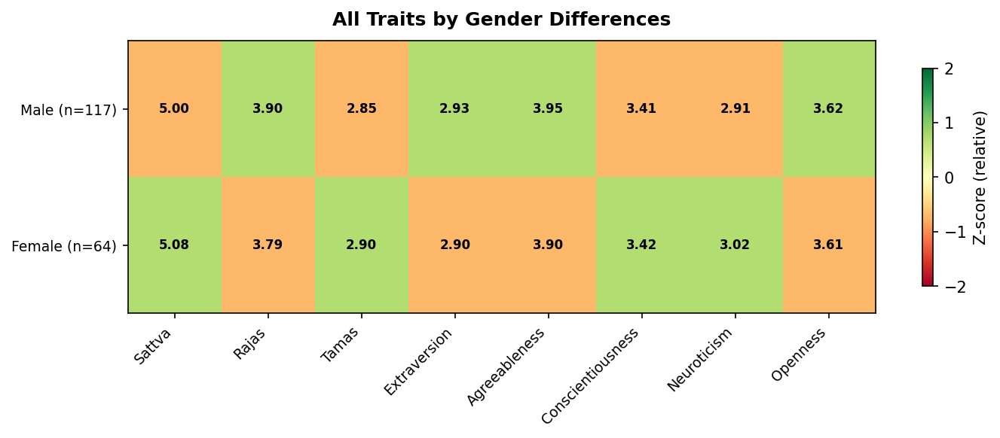

### 2.2 Guna Trait Distributions
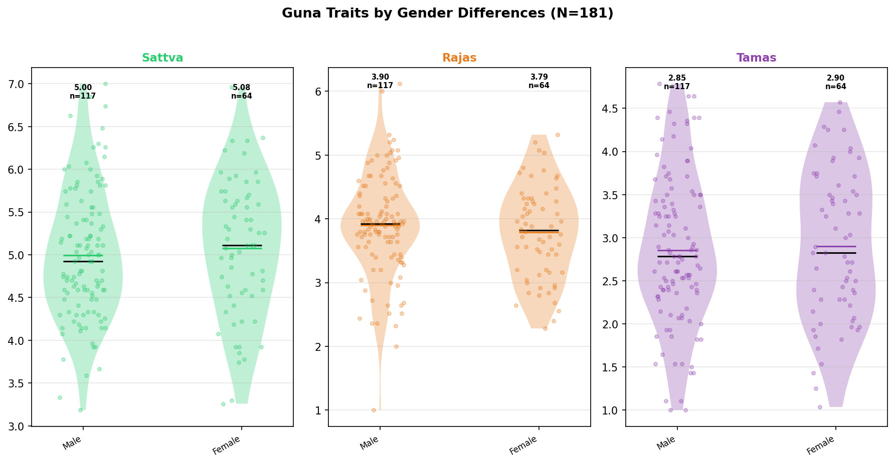

### 2.3 Big Five Trait Distributions
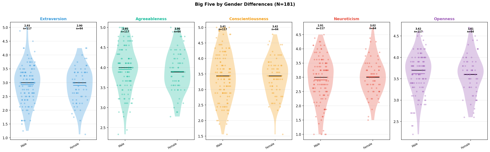

### 2.4 Statistical Tests

**0 significant results** out of 8 tests:

| Trait | Test | Groups | Means | Statistic | p-value | Sig | Effect Size |
| :--- | :--- | :--- | :--- | :---: | :---: | :---: | :--- |
| Sattva | t-test | Male vs Female | 5.00 vs 5.08 | -0.67 | 0.501 | ns | Cohen's d=-0.105 (Negligible) |
| Rajas | t-test | Male vs Female | 3.90 vs 3.79 | 0.93 | 0.352 | ns | Cohen's d=0.145 (Negligible) |
| Tamas | t-test | Male vs Female | 2.85 vs 2.90 | -0.35 | 0.730 | ns | Cohen's d=-0.054 (Negligible) |
| Extraversion | t-test | Male vs Female | 2.93 vs 2.90 | 0.25 | 0.801 | ns | Cohen's d=0.039 (Negligible) |
| Agreeableness | t-test | Male vs Female | 3.95 vs 3.90 | 0.58 | 0.561 | ns | Cohen's d=0.091 (Negligible) |
| Conscientiousness | t-test | Male vs Female | 3.41 vs 3.42 | -0.04 | 0.970 | ns | Cohen's d=-0.006 (Negligible) |
| Neuroticism | t-test | Male vs Female | 2.91 vs 3.02 | -0.95 | 0.343 | ns | Cohen's d=-0.148 (Negligible) |
| Openness | t-test | Male vs Female | 3.62 vs 3.61 | 0.18 | 0.854 | ns | Cohen's d=0.029 (Negligible) |

### 2.5 Key Findings

---
## 3. UG Year Progression
*How do Guna and Big Five traits evolve across university years?*

**Sample**: N=65 | **Groups**: 1, 2, 3, 4

### 3.1 Mean Score Heatmap
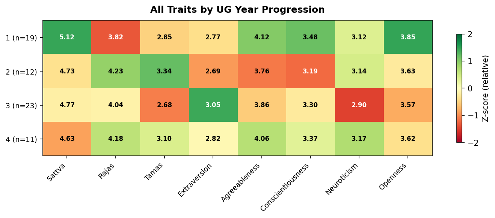

### 3.2 Guna Trait Distributions
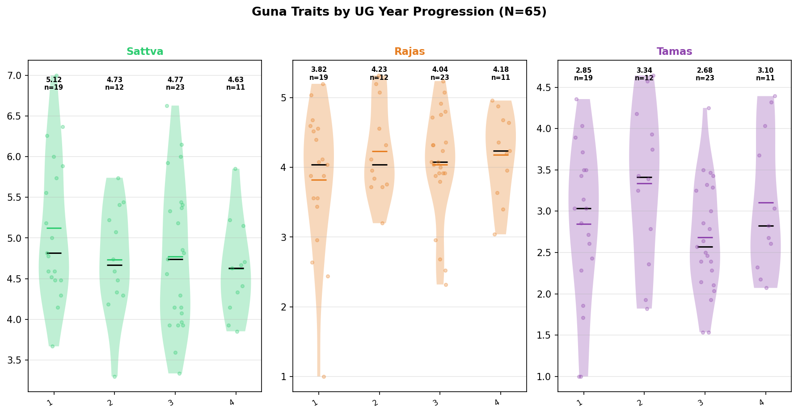

### 3.3 Big Five Trait Distributions
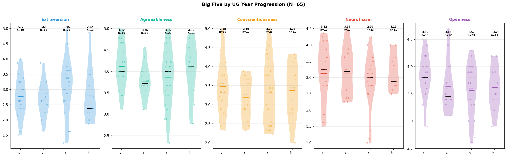

### 3.4 Statistical Tests

**0 significant results** out of 8 tests:

| Trait | Test | Groups | Means | Statistic | p-value | Sig | Effect Size |
| :--- | :--- | :--- | :--- | :---: | :---: | :---: | :--- |
| Sattva | ANOVA | 1 / 2 / 3 / 4 | 5.12 / 4.73 / 4.77 / 4.63 | 1.15 | 0.337 | ns | eta-squared=0.053 (Small) |
| Rajas | ANOVA | 1 / 2 / 3 / 4 | 3.82 / 4.23 / 4.04 / 4.18 | 0.78 | 0.508 | ns | eta-squared=0.037 (Small) |
| Tamas | ANOVA | 1 / 2 / 3 / 4 | 2.85 / 3.34 / 2.68 / 3.10 | 1.78 | 0.161 | ns | eta-squared=0.080 (Medium) |
| Extraversion | ANOVA | 1 / 2 / 3 / 4 | 2.77 / 2.69 / 3.05 / 2.82 | 0.74 | 0.535 | ns | eta-squared=0.035 (Small) |
| Agreeableness | ANOVA | 1 / 2 / 3 / 4 | 4.12 / 3.76 / 3.86 / 4.06 | 1.26 | 0.295 | ns | eta-squared=0.058 (Small) |
| Conscientiousness | ANOVA | 1 / 2 / 3 / 4 | 3.48 / 3.19 / 3.30 / 3.37 | 0.41 | 0.746 | ns | eta-squared=0.020 (Small) |
| Neuroticism | ANOVA | 1 / 2 / 3 / 4 | 3.12 / 3.14 / 2.90 / 3.17 | 0.47 | 0.707 | ns | eta-squared=0.022 (Small) |
| Openness | ANOVA | 1 / 2 / 3 / 4 | 3.85 / 3.63 / 3.57 / 3.62 | 1.52 | 0.218 | ns | eta-squared=0.070 (Medium) |

### 3.5 Key Findings

---
## 4. Spiritual Practice
*Does regular spiritual practice predict higher Sattva and lower Tamas?*

**Sample**: N=181 | **Groups**: Regular, Occasional, Rarely, Never

### 4.1 Mean Score Heatmap
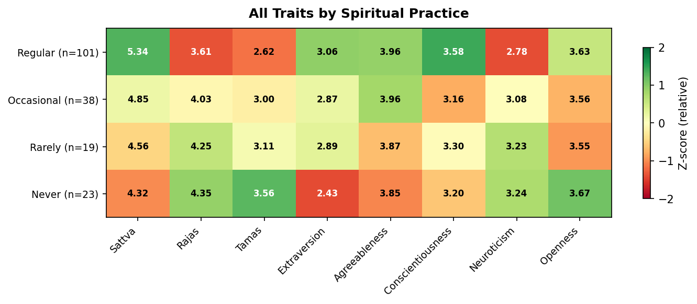

### 4.2 Guna Trait Distributions
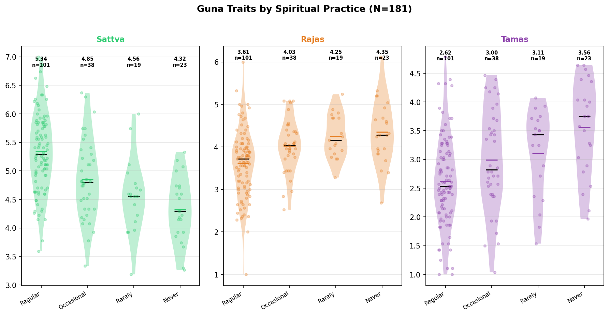

### 4.3 Big Five Trait Distributions
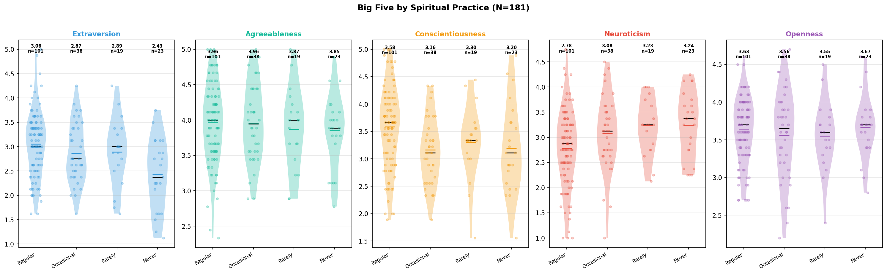

### 4.4 Statistical Tests

**25 significant results** out of 27 tests:

| Trait | Test | Groups | Means | Statistic | p-value | Sig | Effect Size |
| :--- | :--- | :--- | :--- | :---: | :---: | :---: | :--- |
| Sattva | ANOVA | Regular / Occasional / Rarely / Never | 5.34 / 4.85 / 4.56 / 4.32 | 19.55 | < 0.001 | *** | eta-squared=0.249 (Large) |
| Sattva |   post-hoc | Regular vs Occasional | 5.34 vs 4.85 | 3.71 | < 0.001 | *** | Cohen's d=0.707 (Medium) |
| Sattva |   post-hoc | Regular vs Rarely | 5.34 vs 4.56 | 4.56 | < 0.001 | *** | Cohen's d=1.141 (Large) |
| Sattva |   post-hoc | Regular vs Never | 5.34 vs 4.32 | 6.53 | < 0.001 | *** | Cohen's d=1.509 (Large) |
| Sattva |   post-hoc | Occasional vs Never | 4.85 vs 4.32 | 3.06 | 0.003 | ** | Cohen's d=0.809 (Large) |
| Rajas | ANOVA | Regular / Occasional / Rarely / Never | 3.61 / 4.03 / 4.25 / 4.35 | 9.97 | < 0.001 | *** | eta-squared=0.145 (Large) |
| Rajas |   post-hoc | Regular vs Occasional | 3.61 vs 4.03 | -2.92 | 0.004 | ** | Cohen's d=-0.556 (Medium) |
| Rajas |   post-hoc | Regular vs Rarely | 3.61 vs 4.25 | -3.39 | < 0.001 | *** | Cohen's d=-0.848 (Large) |
| Rajas |   post-hoc | Regular vs Never | 3.61 vs 4.35 | -4.10 | < 0.001 | *** | Cohen's d=-0.946 (Large) |
| Tamas | ANOVA | Regular / Occasional / Rarely / Never | 2.62 / 3.00 / 3.11 / 3.56 | 9.80 | < 0.001 | *** | eta-squared=0.142 (Large) |
| Tamas |   post-hoc | Regular vs Occasional | 2.62 vs 3.00 | -2.45 | 0.016 | * | Cohen's d=-0.466 (Small) |
| Tamas |   post-hoc | Regular vs Rarely | 2.62 vs 3.11 | -2.55 | 0.012 | * | Cohen's d=-0.637 (Medium) |
| Tamas |   post-hoc | Regular vs Never | 2.62 vs 3.56 | -5.20 | < 0.001 | *** | Cohen's d=-1.201 (Large) |
| Tamas |   post-hoc | Occasional vs Never | 3.00 vs 3.56 | -2.48 | 0.016 | * | Cohen's d=-0.656 (Medium) |
| Extraversion | ANOVA | Regular / Occasional / Rarely / Never | 3.06 / 2.87 / 2.89 / 2.43 | 5.77 | < 0.001 | *** | eta-squared=0.089 (Medium) |
| Extraversion |   post-hoc | Regular vs Never | 3.06 vs 2.43 | 4.04 | < 0.001 | *** | Cohen's d=0.934 (Large) |
| Extraversion |   post-hoc | Occasional vs Never | 2.87 vs 2.43 | 2.51 | 0.015 | * | Cohen's d=0.664 (Medium) |
| Extraversion |   post-hoc | Rarely vs Never | 2.89 vs 2.43 | 2.08 | 0.044 | * | Cohen's d=0.646 (Medium) |
| Agreeableness | ANOVA | Regular / Occasional / Rarely / Never | 3.96 / 3.96 / 3.87 / 3.85 | 0.36 | 0.783 | ns | eta-squared=0.006 |
| Conscientiousness | ANOVA | Regular / Occasional / Rarely / Never | 3.58 / 3.16 / 3.30 / 3.20 | 4.26 | 0.006 | ** | eta-squared=0.067 (Medium) |
| Conscientiousness |   post-hoc | Regular vs Occasional | 3.58 vs 3.16 | 3.13 | 0.002 | ** | Cohen's d=0.595 (Medium) |
| Conscientiousness |   post-hoc | Regular vs Never | 3.58 vs 3.20 | 2.20 | 0.030 | * | Cohen's d=0.508 (Medium) |
| Neuroticism | ANOVA | Regular / Occasional / Rarely / Never | 2.78 / 3.08 / 3.23 / 3.24 | 4.30 | 0.006 | ** | eta-squared=0.068 (Medium) |
| Neuroticism |   post-hoc | Regular vs Occasional | 2.78 vs 3.08 | -2.04 | 0.044 | * | Cohen's d=-0.387 (Small) |
| Neuroticism |   post-hoc | Regular vs Rarely | 2.78 vs 3.23 | -2.41 | 0.018 | * | Cohen's d=-0.602 (Medium) |
| Neuroticism |   post-hoc | Regular vs Never | 2.78 vs 3.24 | -2.66 | 0.009 | ** | Cohen's d=-0.614 (Medium) |
| Openness | ANOVA | Regular / Occasional / Rarely / Never | 3.63 / 3.56 / 3.55 / 3.67 | 0.42 | 0.742 | ns | eta-squared=0.007 |

### 4.5 Key Findings
- **Sattva**: Regular scored highest (5.34) vs Never lowest (4.32), eta-squared=0.007
- **Rajas**: Never scored highest (4.35) vs Regular lowest (3.61), eta-squared=0.007
- **Tamas**: Never scored highest (3.56) vs Regular lowest (2.62), eta-squared=0.007
- **Extraversion**: Regular scored highest (3.06) vs Never lowest (2.43), eta-squared=0.007
- **Conscientiousness**: Regular scored highest (3.58) vs Occasional lowest (3.16), eta-squared=0.007
- **Neuroticism**: Never scored highest (3.24) vs Regular lowest (2.78), eta-squared=0.007

---
## 5. Bhagavad Gita Familiarity
*Does familiarity with the Bhagavad Gita correlate with Guna scores?*

**Sample**: N=181 | **Groups**: Very Familiar, Somewhat, Heard of it, Not at all

### 5.1 Mean Score Heatmap
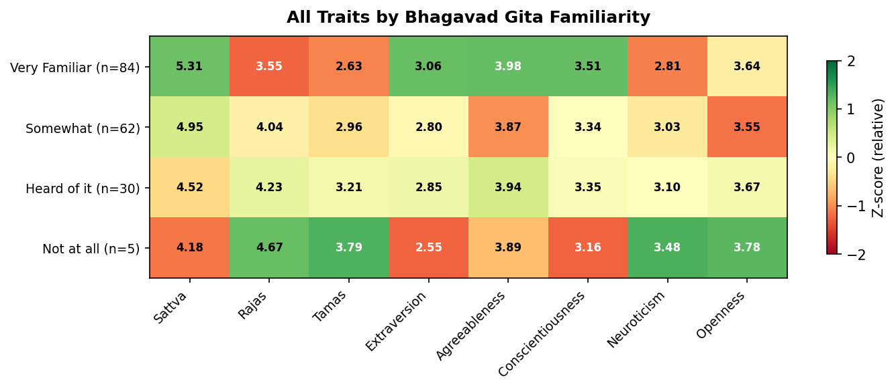

### 5.2 Guna Trait Distributions
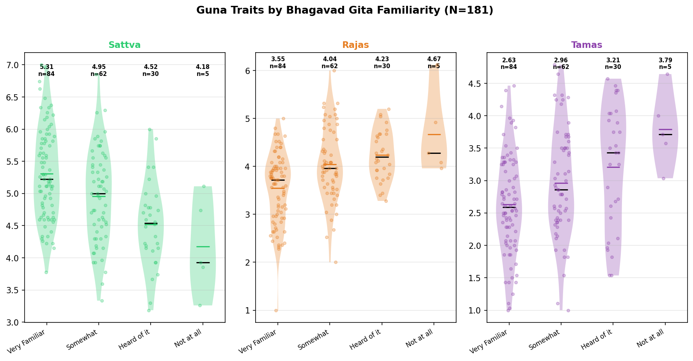

### 5.3 Big Five Trait Distributions
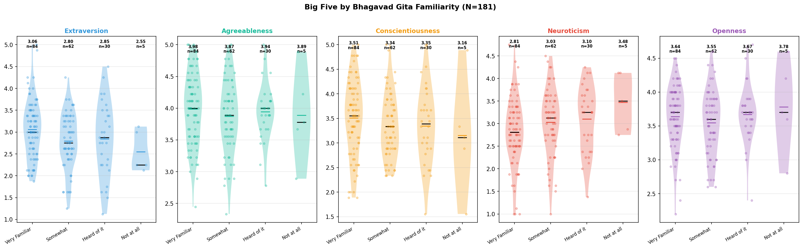

### 5.4 Statistical Tests

**15 significant results** out of 20 tests:

| Trait | Test | Groups | Means | Statistic | p-value | Sig | Effect Size |
| :--- | :--- | :--- | :--- | :---: | :---: | :---: | :--- |
| Sattva | ANOVA | Very Familiar / Somewhat / Heard of it / Not at all | 5.31 / 4.95 / 4.52 / 4.18 | 12.18 | < 0.001 | *** | eta-squared=0.171 (Large) |
| Sattva |   post-hoc | Very Familiar vs Somewhat | 5.31 vs 4.95 | 2.97 | 0.004 | ** | Cohen's d=0.497 (Small) |
| Sattva |   post-hoc | Very Familiar vs Heard of it | 5.31 vs 4.52 | 5.30 | < 0.001 | *** | Cohen's d=1.128 (Large) |
| Sattva |   post-hoc | Very Familiar vs Not at all | 5.31 vs 4.18 | 3.45 | < 0.001 | *** | Cohen's d=1.588 (Large) |
| Sattva |   post-hoc | Somewhat vs Heard of it | 4.95 vs 4.52 | 2.77 | 0.007 | ** | Cohen's d=0.616 (Medium) |
| Sattva |   post-hoc | Somewhat vs Not at all | 4.95 vs 4.18 | 2.31 | 0.024 | * | Cohen's d=1.073 (Large) |
| Rajas | ANOVA | Very Familiar / Somewhat / Heard of it / Not at all | 3.55 / 4.04 / 4.23 / 4.67 | 11.66 | < 0.001 | *** | eta-squared=0.165 (Large) |
| Rajas |   post-hoc | Very Familiar vs Somewhat | 3.55 vs 4.04 | -4.00 | < 0.001 | *** | Cohen's d=-0.669 (Medium) |
| Rajas |   post-hoc | Very Familiar vs Heard of it | 3.55 vs 4.23 | -4.77 | < 0.001 | *** | Cohen's d=-1.015 (Large) |
| Rajas |   post-hoc | Very Familiar vs Not at all | 3.55 vs 4.67 | -3.33 | 0.001 | ** | Cohen's d=-1.532 (Large) |
| Tamas | ANOVA | Very Familiar / Somewhat / Heard of it / Not at all | 2.63 / 2.96 / 3.21 / 3.79 | 6.44 | < 0.001 | *** | eta-squared=0.098 (Medium) |
| Tamas |   post-hoc | Very Familiar vs Somewhat | 2.63 vs 2.96 | -2.47 | 0.015 | * | Cohen's d=-0.413 (Small) |
| Tamas |   post-hoc | Very Familiar vs Heard of it | 2.63 vs 3.21 | -3.32 | 0.001 | ** | Cohen's d=-0.707 (Medium) |
| Tamas |   post-hoc | Very Familiar vs Not at all | 2.63 vs 3.79 | -3.31 | 0.001 | ** | Cohen's d=-1.526 (Large) |
| Tamas |   post-hoc | Somewhat vs Not at all | 2.96 vs 3.79 | -2.17 | 0.034 | * | Cohen's d=-1.008 (Large) |
| Extraversion | ANOVA | Very Familiar / Somewhat / Heard of it / Not at all | 3.06 / 2.80 / 2.85 / 2.55 | 2.47 | 0.063 | ns | eta-squared=0.040 (Small) |
| Agreeableness | ANOVA | Very Familiar / Somewhat / Heard of it / Not at all | 3.98 / 3.87 / 3.94 / 3.89 | 0.50 | 0.684 | ns | eta-squared=0.008 |
| Conscientiousness | ANOVA | Very Familiar / Somewhat / Heard of it / Not at all | 3.51 / 3.34 / 3.35 / 3.16 | 0.99 | 0.397 | ns | eta-squared=0.017 (Small) |
| Neuroticism | ANOVA | Very Familiar / Somewhat / Heard of it / Not at all | 2.81 / 3.03 / 3.10 / 3.48 | 2.58 | 0.055 | ns | eta-squared=0.042 (Small) |
| Openness | ANOVA | Very Familiar / Somewhat / Heard of it / Not at all | 3.64 / 3.55 / 3.67 / 3.78 | 0.88 | 0.455 | ns | eta-squared=0.015 (Small) |

### 5.5 Key Findings
- **Sattva**: Very Familiar scored highest (5.31) vs Not at all lowest (4.18), eta-squared=0.015 (Small)
- **Rajas**: Not at all scored highest (4.67) vs Very Familiar lowest (3.55), eta-squared=0.015 (Small)
- **Tamas**: Not at all scored highest (3.79) vs Very Familiar lowest (2.63), eta-squared=0.015 (Small)

---
## 6. Student vs Working Professional
*Do students and professionals differ in personality profiles?*

**Sample**: N=156 | **Groups**: Student, Working Professional

### 6.1 Mean Score Heatmap
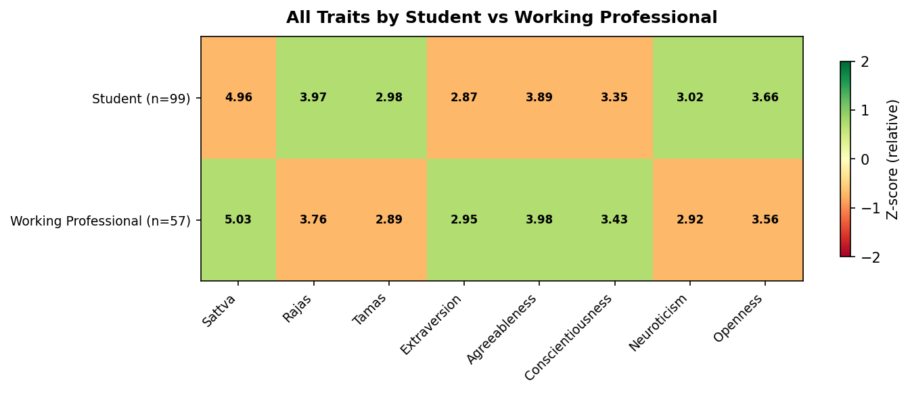

### 6.2 Guna Trait Distributions
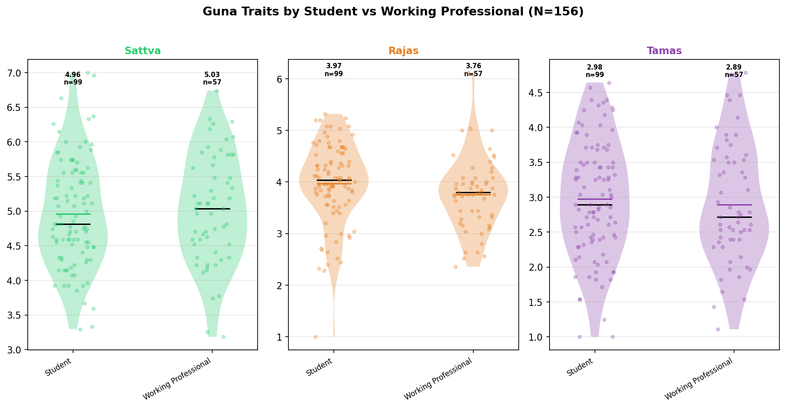

### 6.3 Big Five Trait Distributions
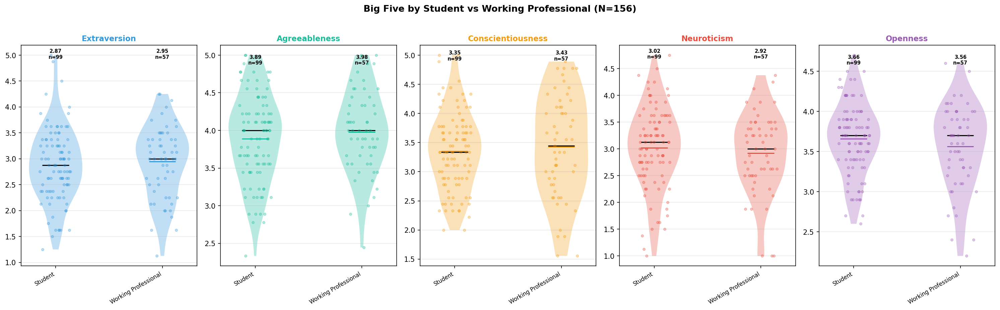

### 6.4 Statistical Tests

**0 significant results** out of 8 tests:

| Trait | Test | Groups | Means | Statistic | p-value | Sig | Effect Size |
| :--- | :--- | :--- | :--- | :---: | :---: | :---: | :--- |
| Sattva | t-test | Student vs Working Professional | 4.96 vs 5.03 | -0.58 | 0.561 | ns | Cohen's d=-0.097 (Negligible) |
| Rajas | t-test | Student vs Working Professional | 3.97 vs 3.76 | 1.76 | 0.080 | ns | Cohen's d=0.293 (Small) |
| Tamas | t-test | Student vs Working Professional | 2.98 vs 2.89 | 0.62 | 0.537 | ns | Cohen's d=0.103 (Negligible) |
| Extraversion | t-test | Student vs Working Professional | 2.87 vs 2.95 | -0.63 | 0.528 | ns | Cohen's d=-0.105 (Negligible) |
| Agreeableness | t-test | Student vs Working Professional | 3.89 vs 3.98 | -0.97 | 0.333 | ns | Cohen's d=-0.162 (Negligible) |
| Conscientiousness | t-test | Student vs Working Professional | 3.35 vs 3.43 | -0.60 | 0.548 | ns | Cohen's d=-0.100 (Negligible) |
| Neuroticism | t-test | Student vs Working Professional | 3.02 vs 2.92 | 0.81 | 0.420 | ns | Cohen's d=0.135 (Negligible) |
| Openness | t-test | Student vs Working Professional | 3.66 vs 3.56 | 1.23 | 0.220 | ns | Cohen's d=0.205 (Small) |

### 6.5 Key Findings

---
## 7. Education Level
*Does education level influence personality trait scores?*

**Sample**: N=162 | **Groups**: High School, UG (Pursuing), UG (Completed), PG (Completed)

### 7.1 Mean Score Heatmap
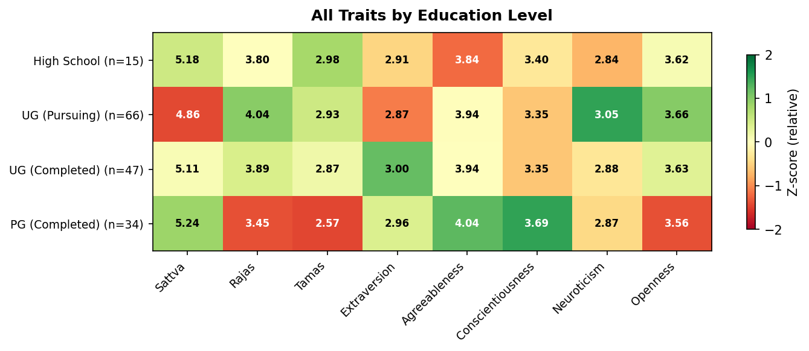

### 7.2 Guna Trait Distributions
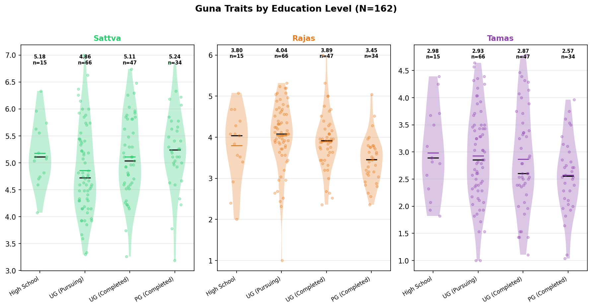

### 7.3 Big Five Trait Distributions
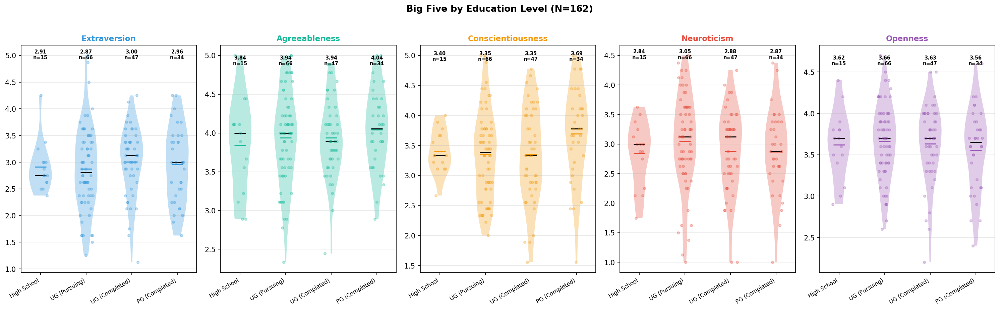

### 7.4 Statistical Tests

**3 significant results** out of 10 tests:

| Trait | Test | Groups | Means | Statistic | p-value | Sig | Effect Size |
| :--- | :--- | :--- | :--- | :---: | :---: | :---: | :--- |
| Sattva | ANOVA | High School / UG (Pursuing) / UG (Completed) / PG (Completed) | 5.18 / 4.86 / 5.11 / 5.24 | 2.34 | 0.075 | ns | eta-squared=0.043 (Small) |
| Rajas | ANOVA | High School / UG (Pursuing) / UG (Completed) / PG (Completed) | 3.80 / 4.04 / 3.89 / 3.45 | 4.83 | 0.003 | ** | eta-squared=0.084 (Medium) |
| Rajas |   post-hoc | UG (Pursuing) vs PG (Completed) | 4.04 vs 3.45 | 3.78 | < 0.001 | *** | Cohen's d=0.798 (Medium) |
| Rajas |   post-hoc | UG (Completed) vs PG (Completed) | 3.89 vs 3.45 | 3.04 | 0.003 | ** | Cohen's d=0.685 (Medium) |
| Tamas | ANOVA | High School / UG (Pursuing) / UG (Completed) / PG (Completed) | 2.98 / 2.93 / 2.87 / 2.57 | 1.55 | 0.204 | ns | eta-squared=0.029 (Small) |
| Extraversion | ANOVA | High School / UG (Pursuing) / UG (Completed) / PG (Completed) | 2.91 / 2.87 / 3.00 / 2.96 | 0.33 | 0.807 | ns | eta-squared=0.006 |
| Agreeableness | ANOVA | High School / UG (Pursuing) / UG (Completed) / PG (Completed) | 3.84 / 3.94 / 3.94 / 4.04 | 0.54 | 0.654 | ns | eta-squared=0.010 (Small) |
| Conscientiousness | ANOVA | High School / UG (Pursuing) / UG (Completed) / PG (Completed) | 3.40 / 3.35 / 3.35 / 3.69 | 1.93 | 0.127 | ns | eta-squared=0.035 (Small) |
| Neuroticism | ANOVA | High School / UG (Pursuing) / UG (Completed) / PG (Completed) | 2.84 / 3.05 / 2.88 / 2.87 | 0.76 | 0.516 | ns | eta-squared=0.014 (Small) |
| Openness | ANOVA | High School / UG (Pursuing) / UG (Completed) / PG (Completed) | 3.62 / 3.66 / 3.63 / 3.56 | 0.38 | 0.771 | ns | eta-squared=0.007 |

### 7.5 Key Findings
- **Rajas**: UG (Pursuing) scored highest (4.04) vs PG (Completed) lowest (3.45), eta-squared=0.007

---
## 8. Overall Interpretation & Research Implications

### Cultural Context
The demographic analysis reveals how the Guna framework captures personality dimensions
that are deeply intertwined with Indian cultural practices and spiritual engagement.

### Key Themes Across Demographics:
1. **Spiritual Practice is the strongest predictor** of Guna scores, validating the GPI's cultural sensitivity
2. **Gita familiarity maps to Sattva**, confirming the theoretical framework
3. **Gender differences** in Gunas may reflect socialization patterns unique to Indian culture
4. **UG year progression** may reveal developmental trends in personality formation
5. **Student vs Professional** differences highlight how life experience shapes personality

### Limitations:
- Sample is predominantly male, potentially biasing gender comparisons
- Year-wise analysis limited to UG students with smaller subgroup sizes
- Cross-sectional design limits causal inference