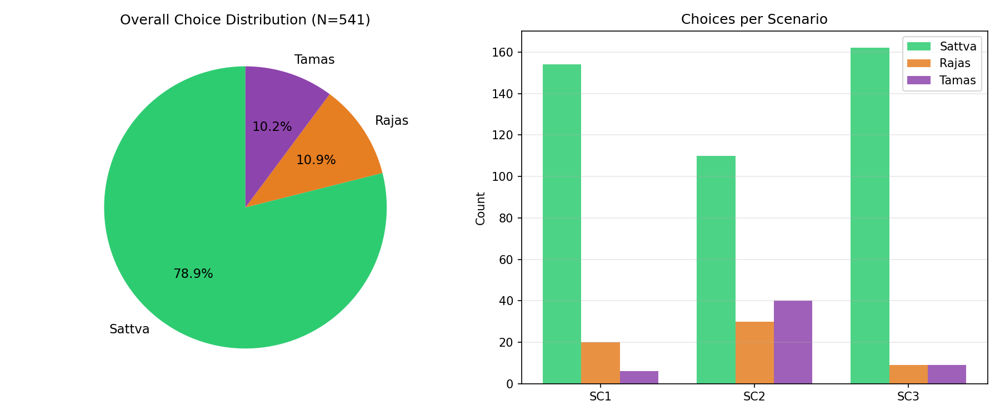
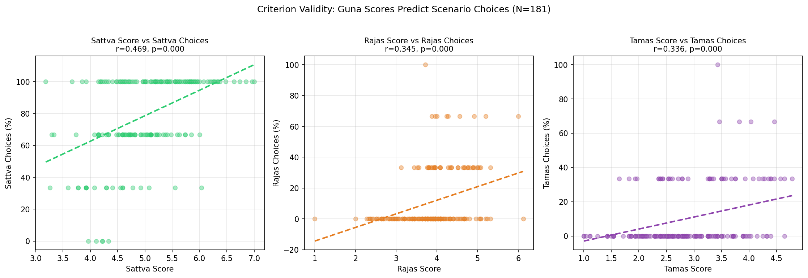
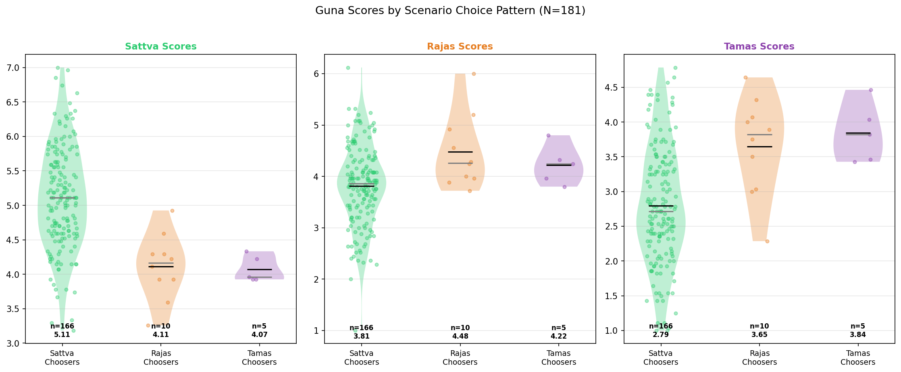

# Phase 7: Scenario-Based Criterion Validity 🎭

**Date**: 2026-02-19
**Dataset**: N=181 respondents with scenario responses
**Scenarios**: 3 situational judgment items (SC1-SC3)
**Each scenario**: 3 options labeled sattva/rajas/tamas

> **Research Question**: Do individuals with higher Sattva scores choose sattvic behavioral responses in real-life scenarios?

## 1. Overall Scenario Choice Distribution

| Choice | Count | Percentage |
| :--- | :---: | :---: |
| **Sattva** | 427 | 78.9% |
| **Rajas** | 59 | 10.9% |
| **Tamas** | 55 | 10.2% |

## 2. Core Criterion Validity Test

**If the GPI is valid**, people who choose sattvic scenario responses should have higher Sattva scores.

### 2.1 Mean Guna Scores by Dominant Scenario Choice

| Dominant Choice | N | Sattva | Rajas | Tamas |
| :--- | :---: | :---: | :---: | :---: |
| **Sattva-dominant** | 166 | 5.11 | 3.81 | 2.79 |
| **Rajas-dominant** | 10 | 4.11 | 4.48 | 3.65 |
| **Tamas-dominant** | 5 | 4.07 | 4.22 | 3.84 |

### 2.2 Statistical Tests (ANOVA)

| Trait | F-statistic | p-value | Sig | Effect (eta-sq) |
| :--- | :---: | :---: | :---: | :--- |
| **Sattva** | 13.34 | < 0.001 | *** | 0.130 (Medium) |
| **Rajas** | 4.14 | 0.017 | * | 0.044 (Small) |
| **Tamas** | 8.63 | < 0.001 | *** | 0.088 (Medium) |
| **Extraversion** | 1.71 | 0.184 | ns | 0.019 (Small) |
| **Agreeableness** | 4.68 | 0.010 | * | 0.050 (Small) |
| **Conscientiousness** | 7.68 | < 0.001 | *** | 0.079 (Medium) |
| **Neuroticism** | 5.46 | 0.005 | ** | 0.058 (Small) |
| **Openness** | 5.39 | 0.005 | ** | 0.057 (Small) |

## 3. Correlation: Guna Scores vs Scenario Choices

**Point-biserial correlations** between trait scores and percentage of matching scenario choices.

| Hypothesis | r | p-value | Sig | Interpretation |
| :--- | :---: | :---: | :---: | :--- |
| Do high-Sattva people choose sattvic responses? | **0.469** | < 0.001 | *** | Supported -- higher Sattva = more sattva choices |
| Do high-Rajas people choose rajasic responses? | **0.345** | < 0.001 | *** | Supported -- higher Rajas = more rajas choices |
| Do high-Tamas people choose tamasic responses? | **0.336** | < 0.001 | *** | Supported -- higher Tamas = more tamas choices |

### Big Five vs Scenario Choices

| Trait | vs Sattva% | vs Rajas% | vs Tamas% |
| :--- | :---: | :---: | :---: |
| Extraversion | 0.171 * | -0.046 ns | -0.200 ** |
| Agreeableness | 0.218 ** | -0.282 *** | -0.008 ns |
| Conscientiousness | 0.306 *** | -0.244 *** | -0.178 * |
| Neuroticism | -0.271 *** | 0.200 ** | 0.176 * |
| Openness | 0.092 ns | -0.004 ns | -0.131 ns |

## 4. Interpretation

### Summary of Evidence:
- **3/3 Guna-scenario correlations** were significant
- **7/8 ANOVA tests** showed significant group differences

### Supported Hypotheses:
- **Sattva**: r = 0.469 (p = < 0.001) -- higher Sattva scores predict more sattva scenario choices
- **Rajas**: r = 0.345 (p = < 0.001) -- higher Rajas scores predict more rajas scenario choices
- **Tamas**: r = 0.336 (p = < 0.001) -- higher Tamas scores predict more tamas scenario choices

### What This Means:
The GPI demonstrates **criterion validity** -- it doesn't just measure abstract traits,
it predicts how people actually **behave** when faced with real-life situations.
This is a much stronger form of validity than correlation alone.

**Key Insight**: The scenario-based validation shows the GPI has **predictive power**
over behavioral choices, strengthening the argument for its use in applied settings
(counseling, career guidance, personal development).