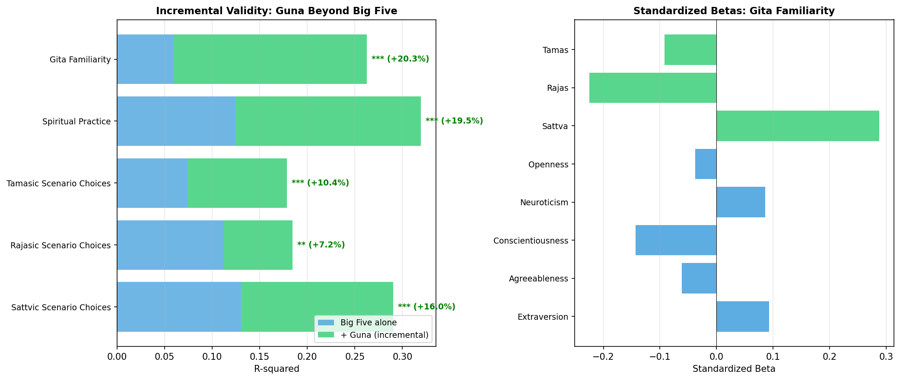

# Phase 8: Incremental Validity (Hierarchical Regression)

**Date**: 2026-02-19
**Dataset**: N=181
**Method**: Hierarchical regression with standardized predictors

> **Research Question**: Does the GPI explain variance in outcomes **beyond** what the Big Five already explains?

## Method

| Step | Predictors | Purpose |
| :---: | :--- | :--- |
| Step 1 | Big Five (E, A, C, N, O) | Baseline model |
| Step 2 | Big Five + Guna (S, R, T) | Test incremental contribution |
| | | If Delta-R2 is significant, Gunas add unique predictive power |

## Results Summary

| Outcome | N | R2 (BFI Only) | R2 (BFI+Guna) | Delta-R2 | F-change | p | Sig |
| :--- | :---: | :---: | :---: | :---: | :---: | :---: | :---: |
| Sattvic Scenario Choices (%) | 181 | 0.130 | 0.290 | **0.160** | 12.94 | < 0.001 | *** |
| Rajasic Scenario Choices (%) | 181 | 0.112 | 0.185 | **0.072** | 5.08 | 0.002 | ** |
| Tamasic Scenario Choices (%) | 181 | 0.074 | 0.179 | **0.104** | 7.29 | < 0.001 | *** |
| Spiritual Practice (ordinal) | 181 | 0.124 | 0.319 | **0.195** | 16.44 | < 0.001 | *** |
| Gita Familiarity (ordinal) | 181 | 0.060 | 0.262 | **0.203** | 15.76 | < 0.001 | *** |

---
### Sattvic Scenario Choices (%)

**Step 1 (BFI only)**: R2 = 0.130 (13.0% of variance)
**Step 2 (BFI + Guna)**: R2 = 0.290 (29.0% of variance)
**Delta-R2** = 0.160 (16.0% additional), F(3,172) = 12.94, p = < 0.001

| Predictor | Beta (Step 2) | Contribution |
| :--- | :---: | :--- |
| Sattva (Guna) | +7.431 | + Strong |
| Tamas (Guna) | -6.893 | - Strong |
| Rajas (Guna) | -4.009 | - Strong |
| Neuroticism (BFI) | +3.514 | + Strong |
| Extraversion (BFI) | +1.651 | + Strong |
| Agreeableness (BFI) | +0.881 | + Strong |
| Conscientiousness (BFI) | -0.504 | - Strong |
| Openness (BFI) | +0.006 | + Weak |

---
### Rajasic Scenario Choices (%)

**Step 1 (BFI only)**: R2 = 0.112 (11.2% of variance)
**Step 2 (BFI + Guna)**: R2 = 0.185 (18.5% of variance)
**Delta-R2** = 0.072 (7.2% additional), F(3,172) = 5.08, p = 0.002

| Predictor | Beta (Step 2) | Contribution |
| :--- | :---: | :--- |
| Sattva (Guna) | -3.975 | - Strong |
| Rajas (Guna) | +3.765 | + Strong |
| Agreeableness (BFI) | -3.484 | - Strong |
| Neuroticism (BFI) | -1.310 | - Strong |
| Openness (BFI) | +1.057 | + Strong |
| Conscientiousness (BFI) | -0.604 | - Strong |
| Tamas (Guna) | +0.569 | + Strong |
| Extraversion (BFI) | +0.319 | + Strong |

---
### Tamasic Scenario Choices (%)

**Step 1 (BFI only)**: R2 = 0.074 (7.4% of variance)
**Step 2 (BFI + Guna)**: R2 = 0.179 (17.9% of variance)
**Delta-R2** = 0.104 (10.4% additional), F(3,172) = 7.29, p = < 0.001

| Predictor | Beta (Step 2) | Contribution |
| :--- | :---: | :--- |
| Tamas (Guna) | +6.324 | + Strong |
| Sattva (Guna) | -3.456 | - Strong |
| Agreeableness (BFI) | +2.603 | + Strong |
| Neuroticism (BFI) | -2.204 | - Strong |
| Extraversion (BFI) | -1.970 | - Strong |
| Conscientiousness (BFI) | +1.108 | + Strong |
| Openness (BFI) | -1.064 | - Strong |
| Rajas (Guna) | +0.244 | + Moderate |

---
### Spiritual Practice (ordinal)

**Step 1 (BFI only)**: R2 = 0.124 (12.4% of variance)
**Step 2 (BFI + Guna)**: R2 = 0.319 (31.9% of variance)
**Delta-R2** = 0.195 (19.5% additional), F(3,172) = 16.44, p = < 0.001

| Predictor | Beta (Step 2) | Contribution |
| :--- | :---: | :--- |
| Sattva (Guna) | +0.436 | + Strong |
| Extraversion (BFI) | +0.206 | + Moderate |
| Tamas (Guna) | -0.186 | - Moderate |
| Rajas (Guna) | -0.153 | - Moderate |
| Conscientiousness (BFI) | -0.128 | - Weak |
| Neuroticism (BFI) | +0.103 | + Weak |
| Agreeableness (BFI) | -0.081 | - Weak |
| Openness (BFI) | -0.079 | - Weak |

---
### Gita Familiarity (ordinal)

**Step 1 (BFI only)**: R2 = 0.060 (6.0% of variance)
**Step 2 (BFI + Guna)**: R2 = 0.262 (26.2% of variance)
**Delta-R2** = 0.203 (20.3% additional), F(3,172) = 15.76, p = < 0.001

| Predictor | Beta (Step 2) | Contribution |
| :--- | :---: | :--- |
| Sattva (Guna) | +0.288 | + Moderate |
| Rajas (Guna) | -0.225 | - Moderate |
| Conscientiousness (BFI) | -0.143 | - Weak |
| Extraversion (BFI) | +0.093 | + Weak |
| Tamas (Guna) | -0.092 | - Weak |
| Neuroticism (BFI) | +0.086 | + Weak |
| Agreeableness (BFI) | -0.061 | - Weak |
| Openness (BFI) | -0.038 | - Weak |

## Visualization

## Interpretation

### 5/5 outcomes showed significant incremental validity

The Guna traits explain **additional variance beyond the Big Five** in:
- **Sattvic Scenario Choices (%)**: +16.0% additional variance (p = < 0.001)
- **Rajasic Scenario Choices (%)**: +7.2% additional variance (p = 0.002)
- **Tamasic Scenario Choices (%)**: +10.4% additional variance (p = < 0.001)
- **Spiritual Practice (ordinal)**: +19.5% additional variance (p = < 0.001)
- **Gita Familiarity (ordinal)**: +20.3% additional variance (p = < 0.001)

### Practical Significance
This demonstrates that the GPI captures meaningful psychological dimensions
that are **invisible** to the Big Five model. Specifically:
- Guna traits predict behavioral choices (scenarios) and cultural engagement
  (spiritual practice, Gita familiarity) better than Big Five alone
- This justifies the GPI as a **complementary** instrument to standard
  personality measures, not merely a redundant translation of Western constructs

### Implication for Indian Psychology
The incremental validity evidence supports the position that Guna-based
personality dimensions capture culturally specific aspects of human nature
that Western personality models were not designed to measure.