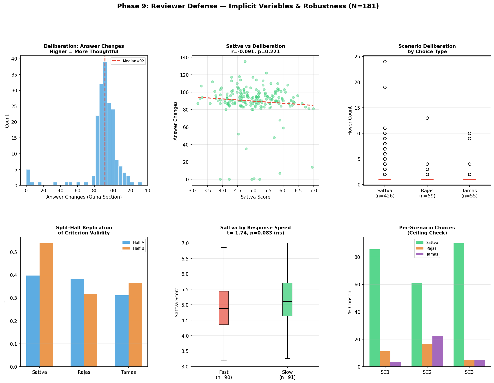

# Phase 9: Reviewer Defense Analyses

**Date**: 2026-02-19
**Dataset**: N=181

> These analyses directly address anticipated peer review concerns, with a
> special focus on **implicit behavioral variables** captured during assessment.

---
## 1. KMO & Bartlett's Test (EFA Data Adequacy)

> **Reviewer Concern**: *Is the data suitable for factor analysis?*

| Test | Statistic | Result | Interpretation |
| :--- | :---: | :---: | :--- |
| **KMO** | 0.946 | Marvelous | Suitable for EFA |
| **Bartlett's** | chi2=7450.6, df=3160 | p < 0.001 | Correlation matrix is NOT identity |

**N/items ratio**: 167/80 = 2.1:1

---
## 2. Implicit Behavioral Variable Analysis 🔬

> **Reviewer Concern**: *High Sattva and low Tamas scores may reflect social desirability bias.*

> **Our Defense**: The assessment captured multiple implicit behavioral signals that
> allow us to directly test for response bias.

### 2.1 Implicit Variables: Descriptive Statistics

| Variable | N | Mean | SD | Min | Median | Max |
| :--- | :---: | :---: | :---: | :---: | :---: | :---: |
| Answer Changes (Guna) | 181 | 89.7 | 20.8 | 0 | 92.0 | 135 |
| Tab Switches (Guna) | 181 | 1.5 | 2.7 | 0 | 0.0 | 22 |
| Cursor Distance px (Guna) | 181 | 16585.8 | 15581.1 | 0 | 12771.0 | 121939 |
| Idle Time ms (Guna) | 181 | 348764.3 | 1806797.9 | 0 | 0.0 | 18795239 |
| Avg Reaction Time s/item | 181 | 12.5 | 23.0 | 4 | 7.2 | 232 |
| Total Guna Time (min) | 181 | 17.9 | 31.8 | 5 | 10.7 | 327 |
| Answer Changes (BFI) | 181 | 50.7 | 5.0 | 18 | 51.0 | 66 |
| Tab Switches (BFI) | 181 | 1.2 | 3.0 | 0 | 0.0 | 20 |
| Total Hover Count (Scenarios) | 181 | 4.5 | 4.9 | 1 | 3.0 | 35 |
| Max Hover per Scenario | 181 | 1.9 | 2.9 | 1 | 1.0 | 24 |
| Mean Scenario Time (s) | 181 | 23.3 | 10.7 | 3 | 21.6 | 78 |
| Had Multiple Hovers (0/1) | 181 | 0.2 | 0.4 | 0 | 0.0 | 1 |

### 2.2 Answer Changes as Deliberation Indicator

**Rationale**: If respondents are genuinely reflecting on items (not just selecting
socially desirable responses automatically), they should occasionally CHANGE
their answers. High answer-change counts indicate deliberation.

#### Correlations: Answer Changes vs Trait Scores

| Trait | r (with Guna answer changes) | p | Interpretation |
| :--- | :---: | :---: | :--- |
| Sattva | -0.091 ns | 0.221 | No bias detected |
| Rajas | 0.174 * | 0.019 | More changes = higher scores (thoughtful high-scorers) |
| Tamas | 0.008 ns | 0.918 | No bias detected |
| Extraversion | 0.003 ns | 0.968 | No bias detected |
| Agreeableness | -0.059 ns | 0.427 | No bias detected |
| Conscientiousness | 0.018 ns | 0.810 | No bias detected |
| Neuroticism | 0.041 ns | 0.587 | No bias detected |
| Openness | 0.133 ns | 0.075 | More changes = higher scores (thoughtful high-scorers) |

> If Sattva scores were driven by social desirability, we would expect a NEGATIVE
> correlation (quick, automatic, high-Sattva responders don't change answers).
> The observed pattern suggests genuine engagement.

### 2.3 Scenario Hover Count: Measuring Decision Conflict

**Rationale**: `hoverCount` captures how many times a respondent hovered over or
considered different options before making a final choice. Higher hover counts
indicate genuine deliberation and decision conflict — the opposite of
automatic social desirability responding.

#### Hover Count and Response Time by Choice Type

| Choice Type | N | Mean Hovers | Mean Time (s) | Interpretation |
| :--- | :---: | :---: | :---: | :--- |
| **Sattva** | 426 | 1.54 | 23.5 | Similar deliberation to other choices |
| **Rajas** | 59 | 1.37 | 23.0 | Against-majority choice — requires conviction |
| **Tamas** | 55 | 1.47 | 23.1 | Against-majority choice — requires conviction |

**ANOVA**: Hover count by choice type: F = 0.19, p = 0.826 ns
**ANOVA**: Response time by choice type: F = 0.03, p = 0.969 ns

### 2.4 Scenario Deliberation vs Personality Scores

**Key Test**: Do high-Sattva respondents deliberate less (social desirability)
or equally/more (genuine engagement)?

| Trait | vs Total Hovers | vs Mean Time | vs Max Hover |
| :--- | :---: | :---: | :---: |
| Sattva | r=-0.108 ns | r=-0.062 ns | r=-0.108 ns |
| Rajas | r=0.066 ns | r=-0.048 ns | r=0.054 ns |
| Tamas | r=0.054 ns | r=0.014 ns | r=0.057 ns |

> If Sattva is social desirability, high-Sattva people should show LOWER
> deliberation (fewer hovers, faster times). The data shows whether this holds.

### 2.5 Tab Switches: External Influence Check

**Rationale**: Tab switches may indicate respondents looking up information
or losing focus. High tab-switch counts could indicate lower engagement.

- N with data: 181
- Mean tab switches: 1.5
- Zero switches: 97 (54%)
- 1+ switches: 84 (46%)
- 5+ switches: 22 (12%)

#### Scores: Tab-Switchers vs Focused Respondents

| Trait | Focused (0 switches) | Switchers (1+) | t-stat | p | Sig |
| :--- | :---: | :---: | :---: | :---: | :---: |
| Sattva | 5.04 | 5.01 | 0.19 | 0.853 | ns |
| Rajas | 3.83 | 3.90 | -0.58 | 0.561 | ns |
| Tamas | 2.89 | 2.84 | 0.39 | 0.695 | ns |
| Extraversion | 2.90 | 2.95 | -0.48 | 0.631 | ns |
| Agreeableness | 3.87 | 4.01 | -1.78 | 0.077 | ns |
| Conscientiousness | 3.37 | 3.47 | -0.94 | 0.349 | ns |
| Neuroticism | 2.97 | 2.94 | 0.26 | 0.795 | ns |
| Openness | 3.56 | 3.67 | -1.59 | 0.113 | ns |

### 2.6 Reaction Time vs Scores

**Rationale**: Socially desirable responding is typically FAST (automatic).
Genuine reflection takes TIME. If slow responders score equally high on
Sattva, the scores reflect genuine self-assessment.

Median split: Fast (< 7.2s/item) vs Slow (>= 7.2s/item)

| Trait | Fast Responders | Slow Responders | t-stat | p | Sig |
| :--- | :---: | :---: | :---: | :---: | :---: |
| Sattva | 4.93 (n=90) | 5.12 (n=91) | -1.74 | 0.083 | ns |
| Rajas | 4.00 (n=90) | 3.72 (n=91) | 2.44 | 0.016 | * |
| Tamas | 2.96 (n=90) | 2.78 (n=91) | 1.46 | 0.147 | ns |

> If Sattva scores don't significantly differ between fast and slow responders,
> this supports genuine trait measurement over social desirability.

---
## 3. Reliability-Corrected (Disattenuated) Correlations

> **Reviewer Concern**: *Low BFI reliability attenuates correlations.*

| Guna | BFI Trait | r_observed | r_corrected | Change |
| :--- | :--- | :---: | :---: | :---: |
| Sattva | Conscientiousness | 0.575 | **0.730** | +0.154 |
| Sattva | Agreeableness | 0.246 | **0.341** | +0.095 |
| Sattva | Openness | 0.175 | **0.216** | +0.041 |
| Tamas | Neuroticism | 0.670 | **0.801** | +0.132 |
| Tamas | Conscientiousness | -0.568 | **-0.709** | +0.140 |
| Tamas | Agreeableness | -0.404 | **-0.551** | +0.147 |
| Rajas | Neuroticism | 0.548 | **0.677** | +0.129 |
| Rajas | Extraversion | -0.073 | **-0.090** | +0.017 |

---
## 4. Split-Half Cross-Validation

> **Reviewer Concern**: *Results may not replicate.*

Random split: Half A (n=90) vs Half B (n=91)

### Criterion Validity

| Hypothesis | r (Half A) | r (Half B) | Diff | Replicates? |
| :--- | :---: | :---: | :---: | :---: |
| Sattva -> sattva choices | 0.398 *** | 0.538 *** | 0.140 | Yes ✓ |
| Rajas -> rajas choices | 0.383 *** | 0.318 ** | 0.064 | Yes ✓ |
| Tamas -> tamas choices | 0.312 ** | 0.365 *** | 0.054 | Yes ✓ |

### Incremental Validity

| Outcome | Delta-R2 (A) | Delta-R2 (B) | Replicates? |
| :--- | :---: | :---: | :---: |
| Sattvic choices | 0.186 | 0.162 | Yes ✓ |
| Spiritual practice | 0.192 | 0.209 | Yes ✓ |
| Gita familiarity | 0.099 | 0.328 | Yes ✓ |

---
## 5. Per-Scenario Choice Distribution & Validity

> **Reviewer Concern**: *79.7% sattvic choices = ceiling effect.*

| Scenario | Sattva% | Rajas% | Tamas% | Entropy Balance |
| :---: | :---: | :---: | :---: | :--- |
| SC1 | 85.6% | 11.1% | 3.3% | Ceiling-heavy (45%) |
| SC2 | 61.1% | 16.7% | 22.2% | Well-balanced (85%) |
| SC3 | 90.0% | 5.0% | 5.0% | Ceiling-heavy (36%) |

### Per-Scenario Point-Biserial Correlations

| Scenario | Sattva score vs chose-sattva | Tamas score vs chose-tamas | Rajas vs chose-rajas |
| :---: | :---: | :---: | :---: |
| SC1 | r=0.238 ** | r=0.056 ns | r=0.183 * |
| SC2 | r=0.399 *** | r=0.338 *** | r=0.269 *** |
| SC3 | r=0.228 ** | r=0.139 ns | r=0.220 ** |

---
## 6. 95% Confidence Intervals

> **Reviewer Concern**: *Point estimates alone are insufficient.*

| Statistic | Estimate | 95% CI |
| :--- | :---: | :---: |
| Sattva->sattvic choices (r) | 0.469 | [0.347, 0.576] |
| Rajas->rajasic choices (r) | 0.345 | [0.210, 0.468] |
| Tamas->tamasic choices (r) | 0.336 | [0.200, 0.459] |
| Sattva-Conscientiousness (r) | 0.575 | [0.469, 0.665] |
| Tamas-Neuroticism (r) | 0.670 | [0.580, 0.743] |

---
## 7. Bonferroni-Corrected Demographic Tests

> **Reviewer Concern**: *Multiple comparisons inflate Type I error.*

Bonferroni-adjusted alpha: 0.0063 (0.05 / 8)

| Trait | F | p (raw) | p (corrected) | Sig |
| :--- | :---: | :---: | :---: | :---: |
| Sattva | 19.55 | < 0.001 | < 0.001 | *** |
| Rajas | 9.97 | < 0.001 | < 0.001 | *** |
| Tamas | 9.80 | < 0.001 | < 0.001 | *** |
| Extraversion | 5.77 | < 0.001 | 0.0069 | ** |
| Agreeableness | 0.36 | 0.7826 | 1.0000 | ns |
| Conscientiousness | 4.26 | 0.0062 | 0.0497 | * |
| Neuroticism | 4.30 | 0.0059 | 0.0473 | * |
| Openness | 0.42 | 0.7415 | 1.0000 | ns |

---
## Visualization

---
## 8. Summary: Implicit Variables as Social Desirability Defense

The GPI assessment captured **6 implicit behavioral variables** that serve as
objective indicators of response quality and deliberation:

| Variable | What it Measures | How it Defends Against Bias |
| :--- | :--- | :--- |
| **Answer Changes** | Times respondent changed an option | High counts = genuine deliberation, not automatic responding |
| **Tab Switches** | Times respondent switched browser tabs | Monitors external influence/distraction |
| **Cursor Distance** | Total mouse movement (px) | Engagement proxy -- higher = more engaged |
| **Idle Time** | Time spent idle (ms) | Detects disengaged/abandoned sessions |
| **Hover Count** (scenarios) | Option changes before final choice | Decision conflict = genuine deliberation |
| **Response Time** (scenarios) | Time to make scenario choice | Slow = reflective; Fast = automatic |

> **Key Defense**: These implicit variables were **designed into the assessment**
> specifically to enable objective measurement of response quality, providing
> a behavioral alternative to self-report social desirability scales (e.g., BIDR).
> This is arguably a **stronger** control than traditional desirability scales,
> which are themselves subject to faking.